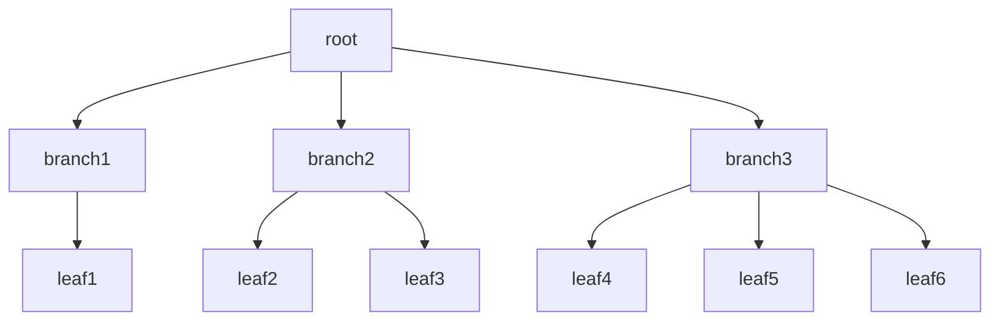

# DB index
- DB에서 테이블에 대한 동작 속도를 높여 주는 **자료 구조**
- DB 쿼리 최적화의 방법 중 하나
- 사전 등에서 사용하는 인덱스 구조와 같은 역할
- 태이블 내 1개의 컬럼 또는 여러 개의 컬럼을 이용하여 생성
- 고유 제약 조건을 실현하기 위해 사용되기도 함
- 인덱스를 저장하는 데 필요한 디스크 공간은 보통 테이블을 저장하는 데 필요한 디스크 공간보다 작음
	- 인덱스는 키-필드만 가지고, 테이블의 세부 항목을 가지고 있지 않음
- 대표적으로 B-tree 구조를 활용함

# index의 장단점
- index를 항상 최신화하기 위해 insert, delete, update가 발생하는 경우 성능이 떨어질 수 있음
- 하지만, 기존 테이블보다 가벼운 구조 때문에 select의 성능이 좋음

## 장점
- 테이블 조회하는 속도와 그에 따른 성능 향상 가능
- 전반적인 시스템 부하 줄일 수 있음

## 단점
- 인덱스 관리를 위해 DB의 추가적인 10% 가량의 저장공간 필요
- 인덱스를 관리하기 위한 추가작업 필요
- 인덱스의 잘못된 사용으로 성능이 저하되는 역효과 발생 가능
	- insert, delete가 빈번하면, 그에 따라 인덱스를 정렬을 지속적으로 실행해야 하는 경우 발생

## 사용하면 좋은 경우
- 인덱스는 select문의 where, join에서 좋은 성능 발휘하지만
- 하지만 insert, update, delete에서의 성능이 떨어짐
- 따라서 select가 많고, insert, update, delete가 적게 일어나는 테이블에서 사용하면 좋음

# index 자료구조

## 해시 테이블
- Key-Value 형태로 데이터 저장

## B-Tree(Balanced Tree)
- 자식 노드의 개수가 2개 이상인 트리
	- 최상위 루트 노드
	- 중간에 위치한 브랜치 노드
	- 가장 하단에 리프 노드
	- key-value 구조에서 key 기준으로 오름차순 정렬
	- 루트에서 리프까지 거리가 항상 동일



## B+Tree
- B-Tree의 확장된 개념
- 리프 노드는 Linked List로 서로 참조하는 구조

# 오라클 인덱스 HINT
```SQL
SELECT /*+INDEX(테이블이름 INDEX이름)*/ 컬럼
FROM 테이블이름
```

- 인덱스를 선택하여 쿼리를 실행
- 아니라면 LIMIT, OFFSET을 활용하여 인덱스를 활용한 검색 가능

# 참조
- https://ko.wikipedia.org/wiki/%EC%9D%B8%EB%8D%B1%EC%8A%A4_(%EB%8D%B0%EC%9D%B4%ED%84%B0%EB%B2%A0%EC%9D%B4%EC%8A%A4)
- https://mangkyu.tistory.com/96
- https://jeong-pro.tistory.com/114
- index 자료 구조 : https://junhyunny.github.io/information/data-structure/db-index-data-structure/
- index hint : https://gent.tistory.com/306