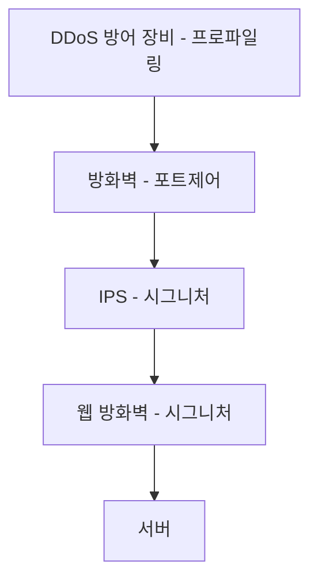

# 보안 솔루션의 종류

- DDoS, 방화벽, IPS, 웹 방화벽(WAF) 형태처럼 여러 단계로 나누어 공격을 막음

## DDoS
- **DoS 공격**(Denial of Service) : 다양한 방법으로 공격 목표에 서비스 부하를 가해 정상적인 서비스를 방해하는 공격 기법
	- 공격 출발지 IP주소 기반으로 충분히 방어할 수 있음
  - 더 짧은 시간에 공격 성고과를 내기 위한 분산 공격을 수행하는 **DDoS**
	  - 볼류메트릭 공격을 우선적으로 막고 완화함을 목적
	  - 볼류메트릭(volumetric) 공격 : 회선 사용량이나 그 이상의 트래픽을 과도하게 발생, 회선 사용양을 방해하는 공격

## 방화벽
- 4계층 패킷 필터링 장비
	- 3, 4 계층 정보 기반으로 정책을 세우고, 매치되는 패킷이 방화벽을 통과할 때 허용 또는 거부

## IDS, IPS
- **IDS**(Intrusion Dection System, 침임 탐지 시스템), **IPS**(Intrusion Prevention Systme, 침입 방지 시스템) : 방화벽에서 할 수 없는 애플리케잇녀 공격 방어

## WAF
- **WAF**(Web Application Firewall) : 웹 서버를 보호하는 정용 장비, HTTP, HTTPS와 같은 웹 프로토콜 공격을 방어
	- 전용 네트워크 장비, 웹 서버의 플러그인, ADC 플러그인, 프록시 장비 플러그인 등의 장비 또는 소프트웨어
- IPS에서 방어할 수 없는 부분을 방어할 수 있음
	- 공격 트래픽 뿐만 아니라, 민감한 데이터가 유출될 때 해당 정보만 제거하는 등의 작업 가능

## 샌드박스
- 예전에는 해커가 원하는 목적지에 직접 공격을 수행했지만, 직접 공격하는것이 보안 등의 강화로 어려워짐
	- 기존 보안 장비를 우회하는 방법으로 공격 방법이 변경
	- 악성 코드를 관리자 PC에 우회적으로 심고 관리자 PC를 컨트롤 하는 방식 사용(악성코드가 있는 사이트, 이메일 등)
	- 방화벽은 내부 사용자가 외부와 정상적인 통신을 한 것으로 판단함
	- 이러한 공격이 발전해 APT(Advanced Persistent Threat, 지능형 지속 공격), ATA(Advanced Target Attack, 지능형 표적 공격)으로 발전
- **샌드 박스** : APT를 방허하는 장비, 악성 코드를 샌드 박스 시스템에서 직접 실행

## NAC
- **NAC**(Network Access Control) : 네트워크에 접속하는 장치를 제어하기 위해 개발, 인가된 사용자만 내부망에 접속할수 있게 함

## IP 제어
- **IP 제어** : 보안사고 추적을 위해 고정 IP 사용 권고 지침이 금융권에 내려오며, IP할당 & 추적하는 솔루션이 생성됨

## 접근 통제
- 운영자가 서버, DB, 네트워크 장비 등 직접 접근해 관리하면 문제가 발생했을 때추적하기 어려움
	- 직접적 접근을 막고, 작업 추적 및 감사를 할 수 있는 접근 통제 솔루션

## VPN
