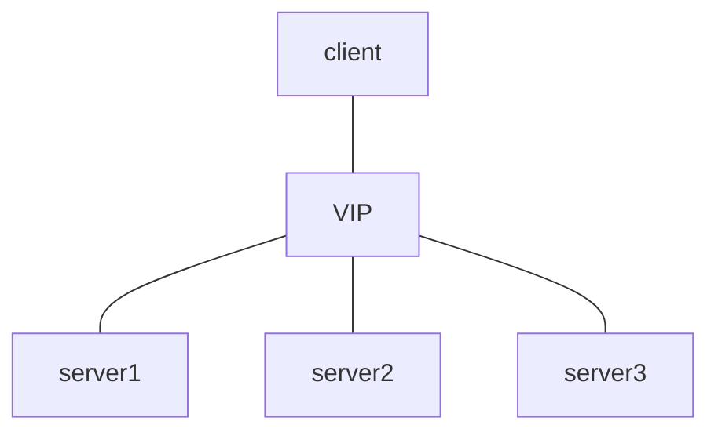

# 부하 분산 방법
- LACP는 두 개 이상의 인터페이스를 하나의 논리 인터페이스로 묶어 회선 부하 분산
- 로드 밸런서도 유사하게 부하를 다수의 장비에 분산시키기 위해 가상 IP주소를 갖게 됨
	- IP주소는 가상 주소이므로 VIP(Virtual IP)라고도 부름
	- 실제 IP주소는 real IP라고 부름

- 1번 서버는 HTTP, 3번 서버는 HTTPS, 2번 서버는 HTTP와 HTTPS서비스가 동작
	- HTTP서비스는 1, 2번 서버로, HTTPS는 2, 3 번 서버로 부하 분산
	- 3계층 IP 주소뿐만아니라 4계층 정보인 포트까지 지정하여 만들기 때문에 L4 스위치라 부름
	- 7계층 정보까지 확인해 처리하는 기능이 포함된 L7스위치도 있음
