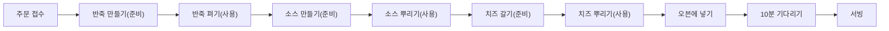
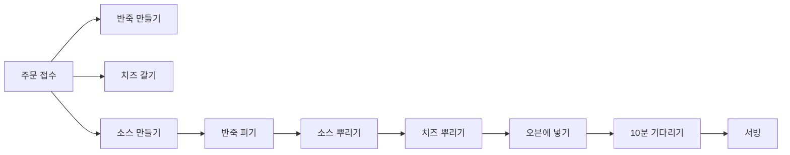
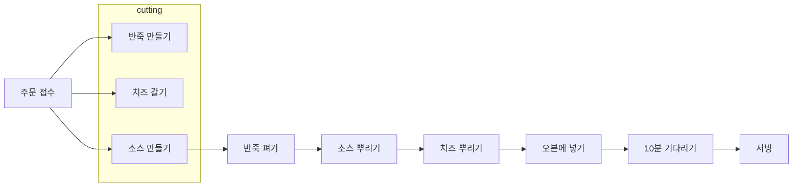

# CH2. 현실에서의 함수형 사고

## 토니의 피자 가게

## 🍕 파트 1 : 액션과 계산, 데이터

- 요리 재료와 기타 필요 자원을 사용하는 코드를 액션으로 구분, 나머지 코드는 계산으로 구분
- 실제로 액션, 계산, 데이터라는 용어를 사용하지 않더라도 아래와 같은 기준으로 나누는 것은 중요

### 액션

- 호출 횟수나 시점에 의존하는 것
- 오븐, 배달차 같은 자원과 요리 재료를 사용하는 것은 액션
  - 반죽 펴기, 피자 배달, 재료 주문

### 계산

- 어떤 것을 결정하거나 계획하는 것으로 실행해도 영향을 주지 않음
  - 조리법에 나온 것을 두 배로 만들기, 쇼핑 목록 결정

### 데이터

- 변경 불가능한(immutable) 데이터를 쓰는 것이 좋음
- 결제, 재고, 피자 조리법 같은 것이 데이터
- 유연하기 때문에 저장하거나 네트워크로 전송하는 등 다양하게 사용 가능
  - 고객 주문, 영수증, 조리법

### 변경 가능성에 따라 코드 나누기

|                     | 피자 주방 레이어                                   | 창고 레이어                                            | 메인 레이어   |
| ------------------- | -------------------------------------------------- | ------------------------------------------------------ | ------------- |
| 자주 바뀌는 것      | 이번주 메뉴 - 이번 주 특별 메뉴를 위한 조리법 | 이번 주 사야 할 것 - 재료를 어디서 구입할 지 결정 | 비즈니스 규칙 |
|                     | 피자 만들기 - 조리법 순서                     | 재료 목록 - 재료 목록에 대한 동작                 | 도메인 규칙   |
| 자주 바뀌지 않는 것 | 자바 스크립트 - 객체 - 배열              | 자바스크립트 - 객체 - 숫자                   | 기술 스택     |

- 각 계층은 그 아래에 있는 계층을 기반으로 만들어지기 때문에 안정적인 기반 위에 작성할 수 있음
  - 이런 구조는 코드를 쉽게 변경할 수 있음
  - 가장 위에 있는 코드는 의존성이 거의 없으며 아래는 의존성이 많지만 자주 바뀌지 않음
- 이 아키텍처 패턴이 계층을 만들기 때문에 **계층형 설계(stratified design)**라고 부름
  - 계층형 설계는 비즈니스 규칙, 도메인 규칙, 기술 스택 계층으로 나눔
- 계층형 설계로 만든 코드는 테스트, 재사용, 유지보수가 쉬움

## 🍕 파트 2: 일급 추상

### 주방을 자동화 하기

- 로봇이 혼자 일하고 있었기 때문에 확장성에 문제
- 고객이 원하는 속도로 피자를 만들 수 없게 됨 

### 타임라인 다이어그램

- 로봇 한 대가 피자를 만들기 위한 액션

- 타임라인 다이어그램을 사용하면 액션이 시간 순서에 따라 어떻게 실행되는지 볼 수 있음
  - 실행 시점에 의존하기 때문에 실행 순서가 중요
- 주방을 더 효율적으로 운영하기 위해 다이어그램을 수정하려고 함

### 분산 시스템을 타임라인으로 시각화

- 로봇 한 대 대신 반죽 만들기, 소스 만들기, 치즈 갈기 작업으로 나누어 로봇 세 대가 동시에 독립 작업 실행

- 타임라인을 서로 맞추지 않은 분산 시스템은 예측 불가능한 순서로 실행
  1. 타임라인은 서로 순서를 맞추지 않음
  2. 액션이 실행되는 시간은 중요하지 않으며, 각각의 타임라인은 다른 타임 라인의 순서와 관계없이 만들어야 함.
  3. 실제 서비스에서 타이밍이 어긋나는 경우가 있음

### 타임라인 커팅 : 로봇이 서로를 기다릴 수 있게 하기

- 여러 타임라인이 동시에 진행될 때 서로 순서를 맞추는 방법
- 고차 동작(high-order operation)으로 구현
  - 각 타임라인은 독립적으로 동작하고 작업이 완료되면 다른 타임라인이 끝나기를 기다림
  - 어떤 타임라인이 먼저 끝나도 괜찮음

- 모든 작업이 완료되면 로봇 한 대가 나머지 작업을 완성

### 타임라인 다이어그램의 장점

- 서로 다른 작업들을 쉽게 이해할 수 있음
- 시간에 따라 진행하는 작업을 쉽게 이해할 수 있음
  - 동시에 실행되는 분산 시스템을 시각화하기 좋음
- 유연하게 코드로 옮기고 모델링할 수 있음