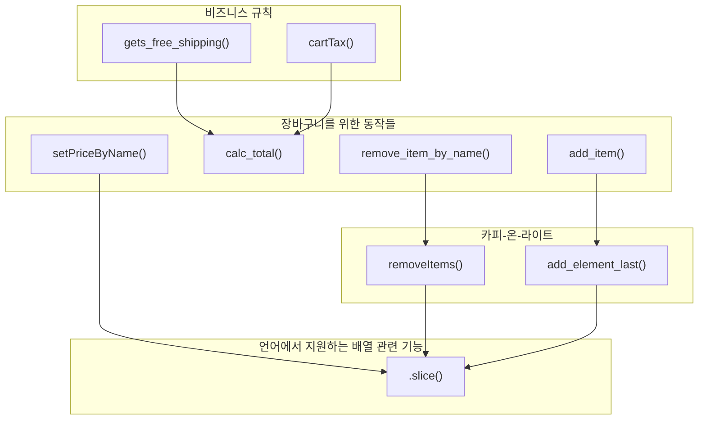
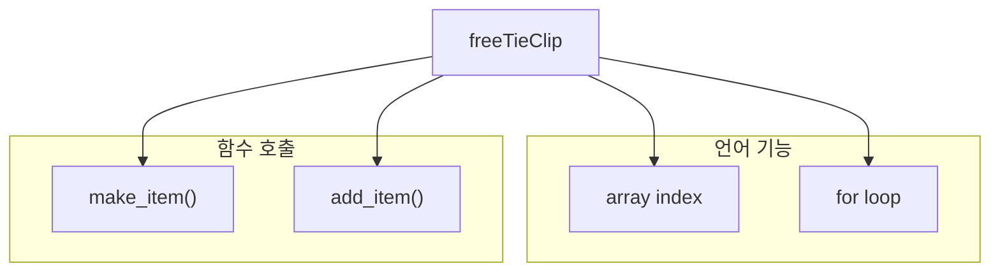
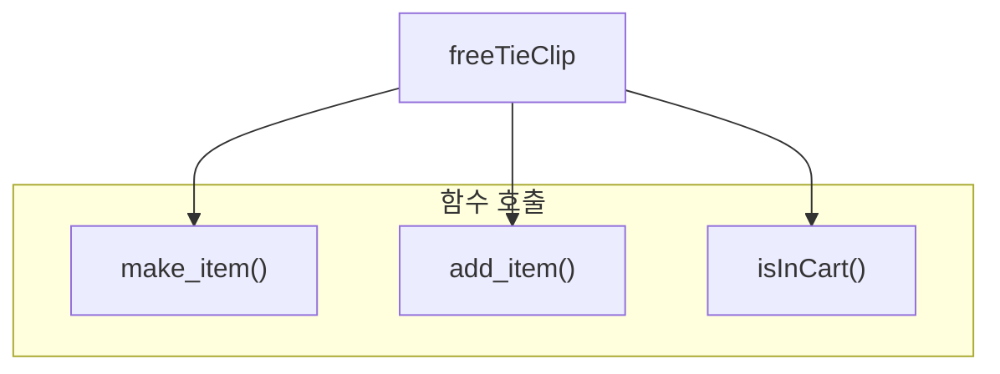
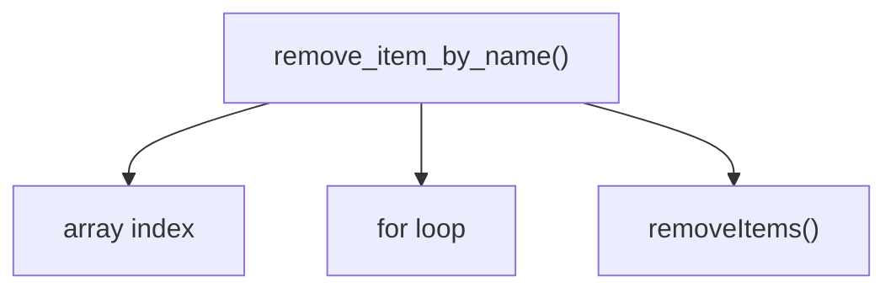
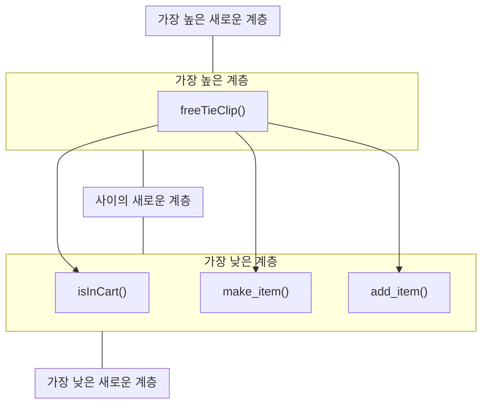

# 계층형 설계 I

## 소프트 웨어 설계란?

> **소프트웨어 설계**
> 코드를 만들고, 테스트, 유지보수 하기 쉬운 프로그래밍 방법을 선택하기 위해 미적 감각을 사용하는 것

- 책에서 다루려 하는 것은 소프트웨어 설계에 대한 실용적인 정의
- **계층형 설계**를 사용해 소프트웨어 설계를 위한 미적 감각 키워볼 것

## 계층형 설계란?

> **계층형 설계**
> 소프트웨어를 계층으로 구성하는 기술
> 각 계층에 있는 함수는 바로 아로 계층에 있는 함수를 정의해 만듬



- 각 계층을 정확히 구분하기는 힘듬
- 각 계층을 잘 구분하기 위해서는 다양한 변수를 찾고, 어떻게 해야 하는지 알아야 함

## 설계 감각 키우기

### 전문가의 저주

- 전문가는 본인 분야를 잘 알지만, 잘 설명 못하는 것으로 악명 높음
- 오랜 시간 축적된 지식이 있지만, 설명하는 방법을 잘 모름
    - 설명하려는 것이 블랙박스와 같기 때문

### 계층형 설계 감각을 키우기 위한 입력

-  계층형 설계 감각을 키우기 위해 다양한 입력을 생각할 수 있음
    - 함수 본문, 계층 구조, 함수 시그니처

### 계층형 설계 감각을 키우기 위한 출력

- 여러 입력을 보면 머리에서 조합하지만, 어떻게 조합하는지 설명하지 못하는 문제
- 입력을 조합해 코드로 만드는데 필요한 출력들이 있음
    - 조직화, 구현, 변경

## 계층형 설계 패턴

- 패턴 1: 직접 구현
- 패턴 2: 추상화 벽
- 패턴 3: 작은 인터페이스
- 패턴 4: 편리한 계층

## 패턴 1: 직접 구현

```js
function freeTieClip(cart) {
    var hasTie = false
    var hasTieClip = false
    for (var i=0; i < cart.length; i++) {
        var itme = cart[i]
        if (item.name === "tie") {
            hasTie = true
        }
        if (item.name === "tile clip") {
            hasTieClip = true
        }
    }
    if (hasTie && !hasTieClip) { 
        var tieClip = make_item("tie clip", 0)
        return add_item(cart, tieClip)
    }
    return cart
}
```

- 어렵지 않은 코드이지만, 많은 기능이 있음
    - 장바구니 목록 확인 및 추가 행동을 하는데, 설계를 하지 않고 필요에 따라 추가 한 것

### 장바구니가 해야 할 동작

- 장바구니 설계 계선을 위한 스프린트, 장바구니가 해야할 동작 정리
- 장바구니가 해야할 동작은 다양함
    - 제품 추가하기 : `add_item()`
    - 제품 삭제하기 : `remove_item_by_name()`
    - 장바구니에 제품이 있는지 확인하기
    - 합계 계산하기 : `calc_total()`
    - 장바구니 비우기
    - 제품 이름으로 가격 설정하기 : `setPriceByName()`
    - 세금 계산하기 : `cartTax()`
    - 무료 배송이 되는지 확인하기 : `gets_free_shipping()`
- 그 중 두가지 동작이 구현되어 있지 않음

### 제품이 있는지 확인하는 함수

```js
function freeTieClip(cart) {
    // var hasTie = false
    // var hasTieClip = false
    var hasTie = isInCart(cart, "tie")
    var hasTieClip = isInCart(cart, "tie clip")
    // for (var i=0; i < cart.length; i++) {
    //     var itme = cart[i]
    //     if (item.name === "tie") {
    //         hasTie = true
    //     }
    //     if (item.name === "tile clip") {
    //         hasTieClip = true
    //     }
    // }
    if (hasTie && !hasTieClip) { 
        var tieClip = make_item("tie clip", 0)
        return add_item(cart, tieClip)
    }
    return cart
}

function isInCart(cart, name) {
    for (var i=0; i <cart;length; i++) {
        if (cart[i].name === name) {
            return true
        }
    }
    return false
}
```

- 기존 제품이 있는지 확인하는 부분을 새로운 함수로 추출



- 기존의 코드를 호출 그래프로 시각화
- 실제로 함수와 언어기능을 모두 호출하지만, 언어기능이 더 낮은 단계의 추상화로 구려져야 됨

### 직접 구현 패턴을 사용하여 비슷한 계층에 있는 함수를 호출



- 원래의 함수에서는 언어기능과 함수호출, 즉 서로 다른 계층을 모두 호출했지만,
- 수정한 코드에서는 기존 언어 기능인 `arryd index`, `for loop`를 제거, 비슷한 계층에 있는 함수를 호출할 수 있도록 함
- 위와 같이 모두 비슷한 계층에 있는 것들을 호출 할 수 있게 한다면, **직접 구현** 했다고 할 수 있음

- 쉬는 시간
    - 호출 그래프가 정말 중요한지?
        - 호출그래프를 통하여 직접구현 한것을 확인한 것일 뿐, 실제로 그려야 할 필요는 없음
        - 하지만, 함수가 많아진다면, 계층 구조를 설명하는데 도움이 될 수 있음
    - 모든 다이어그램을 그러야 하는지?
        - 다이어그램도 마찬가지로 그리지 않아도 되지만, 소통의 도구 등 장점을 활용할 수 있음
    - 앞선 계층이 정답인지?
        - 정확한 정답을 말하기 어려운 질문
        - 계층형 설계는 각자의 관점에 따라 달라질 수 있음
        - 누군가에게는 좋은 코드가 될 수 있지만, 그렇지 않을 수 도 있기 때문에, 다양한 관점으로 살펴보면 좋음

### `remove_item_by_name()` 함수 그래프 그려보기

```js
function remove_item_by_name(cart, name) {
    var idx = null
    for (var i=0; i < cart.length; i++) {
        if (cart[i].name === name) {
            idx =i
        }
    }
    if (idx !== null) {
        return removeItmes(cart, idx, 1)
    }
    return cart
}
```



- 위와 같이 `remove_item_by_name()`함수 호출을 나타낼 수 있음



- 만약 `freeTieClip()` 함수 그래프 옆에 `remove_item_by_name()`그래프를 붙여 넣는다면, 어느 계층에 넣을 수 있을지?
- 적당한 위치를 선정하기 위한 후보는 다양함
    - 가장 높은 계층
        - 기존의 가장 높은 계층인 `freeTieClip()`보다 상위 두는것을 생각해보면,
        - `freeTieClip()`은 마케팅 캠페인 이름인 반면, `remove_item_by_name()`은 마케팅과 관련 없는 일반적인 동작
        - 따라서, 더 높은 계층이나 같은 계층에 두는 것은 부적합함
    - 새로운 가장 낮은 계층
        - 직접 구현으로 생성한 함수들보다 더 낮은 계층은 부적합함
        - 장바구니의 물건을 다루는 함수라는 유사점이 있기 때문에 같은 계층 또는 더 상위 계층이 되는게 접합하고, 더 낮은 계층은 부적합함
    - 가장 낮은 계층
        - 장바구니 상품을 다룬다는 점에서 유사점이 있음
        - 또한 사용하는 함수를 생각하면 공통점이 있음
            - `isInCart()`가 `for loop`, `array index`를 활용하는데 `remove_item_by_name()`역시 이들을 사용함
        - 따라서 이들과 같은 계층에 두는 것이 적합함


- 실제로 배치를 한 결과


- 기존의 다른 함수들까지 같이 배치한 결과

### 같은 계층의 함수는 같은 목적을 가져야 함


- 다이어그램은 여섯 개의 계층으로 구성되었고, 각 계층은 유사한 목적을 가짐

## 3단계 줌 레벨

- 다이어 그램이 너무 많다면, 너무 많은 정보가 있어 문제를 발견하기 어려울 수 있음
- 그러한 문제를 해결하기 위하여 줌 레벨을 나누어 볼 수 있음
    - 전역 줌 레벨 : 계층간 상호 관계를 나타냄
    - 계층 줌 레벨 : 한 계층과 연결된 바로 아래 계층을 볼 수 있는 줌 레벨
    - 함수 줌 레벨 : 특정 함수와 아래 함수를 볼 수 있는 줌 레벨
- 그러한 과정에서 긴 화살표를 더 짧은 화살표로 구체화 할 수 있음 (직접 구현을 통한 새로운 함수 도입)

## 반복문 빼내기

- 반복문은 배열안에서 항목을 순서대로 확인, 조건에 맞는 항목의 인덱스를 추출

```js
function remove_item_by_name(cart, name) {
    // var idx = null
    // for(var i = 0; i < cart.length; i++) {
    //     if(cart[i].name === name)
    //         idx = i
    // }
    var idx = indexOfItem(cart, name)

    if(idx !== null)
        return removeItems(cart, idx, 1)
    return cart
}

function indexOfItem(cart, name) {
    for (var i = 0; i < cart.length; i++) {
        if (cart[i].name === name) { 
            return i
        }
    }
    return null
}
```

- 기존 함수에서는 `for loop`, `array index`, `removeItems()`를 호출함
    - 하지만 세가지는 계층이 같다고 볼 수 없기 때문에, 언어 기능을 따로 호출하는 `indexOfItems()`함수를 활용, 반복문 추출이 됨
    - 따라서 유사한 성격의 함수들이 하나의 함수에서 호출 및 활용될 수 있음

- `isInCart()`, `setPriceByName()` 등도 역시 반복문 추출을 할 수 있음(연습문제)

## 직접 구현 패턴 리뷰

- 직접 구현한 코드는 한 단계의 구체화 수준에 관한 문제만 해결
    - 좋은 설계를 고민하지 않고 만든 코드는 읽거나 고치기 어려움
    - 직접 구현을 통해 구체화 단계의 범위를 줄일 수 있음
- 계층형 설계는 특정 구체화 단계에 집중할 수 있게 도와줌
- 호출 그래프는 구체화 단계에 대한 풍부한 단서를 보여줌
    - 큰 그림으로 전체를 보기에는 너무 많은 정보가 있지만, 호출 그래프는 함수들이 서로 연결된 관계를 보여줌
- 함수를 추출하면 더 일반적인 함수로 만들 수 있음
    - 구체적인 내용만 다루기때문에 테스트하기 쉬워지는 장점 등이있음
- 일반적인 함수가 많을수록 재사용하기 좋음
- 복잡성을 감추지 않음
