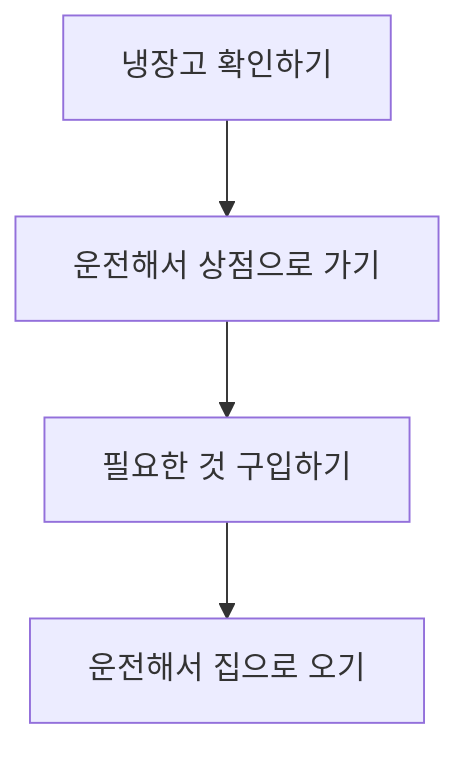
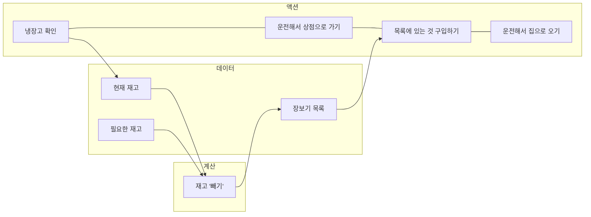
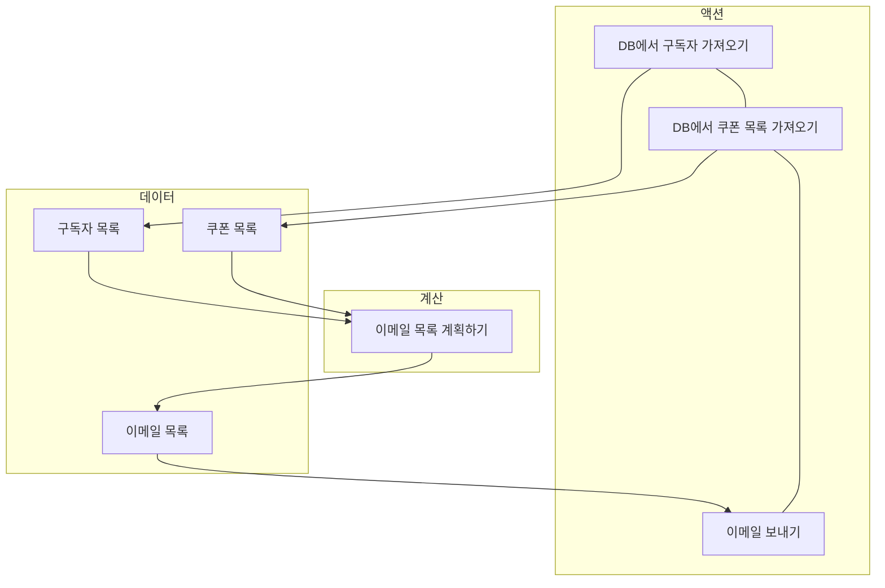
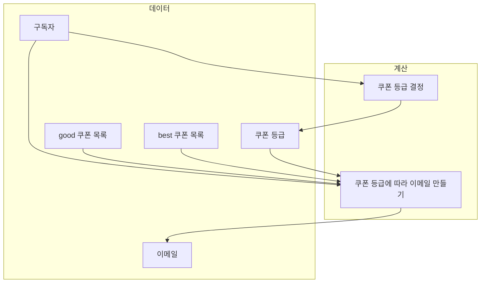

# CH3. 액션과 계산, 데이터의 차이를 알기

## 액션과 계산, 데이터

- 액션, 계산, 데이터 구분
    - 액션 : 실행 시점에 의존, 부수효과가 있는 함수, 순수하지 않은 함수
    - 계산 : 순수 함수, 수학 함수
    - 데이터 : 이벤트에 대한 사실
- 모든 과정에서 액션, 계산, 데이터를 구분하는 기술을 적용할 수 있음
    - 문제를 구상할 때, 코딩할 때, 코드를 읽을 때 등

## 액션과 계산, 데이터는 어디에나 적용할 수 있음



- 장보기 과정을 위와같이 순서대로 나타낼 수 있음
- 각 과정을 순서대로 살펴보면,
    - 냉장고 확인 : 냉장고를 확인하는 시점이 중요하기 때문에 **액션**, 냉장고의 제품은 **데이터**
    - 운전해서 상점으로 가기 : 운전해서 가는 행동은 명확하게 **액션**, 그 과정에서 사용하는 상점 위치나 경로 등은 **데이터**
    - 필요한 것 구입하기 : 구입하는 시점이나 횟수가 중요하기 때문에 **액션**, 구매하는 목록은 **데이터**
        - 장보기 목록 **데이터**를 만들기 위해서, 현재 재고 **데이터**, 필요한 재고 **데이터**를 **계산**하는 과정
    - 운전해서 집으로 오기 : **액션**



- 액션의 흐름에서 각 과정의 데이터, 계산을 추출하여 나타낸 과정
    - 원래는 모두 액션으로 구성되어 있었는데, 액션에서 계산, 데이터를 세분화 할 수 있음
    - 액션안에서 또 다른 액션이나, 계산, 데이터가 숨어 있을 수 있음
    - 계산은 또 다른 계산이나 데이터로 나눌 수 있음
    - 데이터는 데이터만 조합할 수 있음

> 데이터
> - 데이터는 이벤트에 대한 사실
> - 데이터는 JS 기본 데이터 타입으로 구현, 숫자, 문자, 객체 등
> - 데이터의 불변성에 따라, 카피온 라이트, 방어적 복사를 이용 (6, 7장)
> - 데이터의 장점
>   - 데이터는 데이터 자체만으로는 활용하기 힘들지만,
>   - 직렬화하여 전송, 저장 등을 할 수 있고,
>   - 다른 데이터와 비교할 수 있고,
>   - 다양한 방법으로 해석하여 활용할 수 있음
> - 데이터의 단점
>   - 자유로운 해석이 가능하지만, 해석을 해야만 하는 단점

> "유저 생성" 기능을 생각해보면,
> 웹 요청을 통해 유저 **데이터**가 전송되어 유저 생성 **액션** 실행

## 새로 만드는 코드에 함수형 사고 적용하기

- 쿠폰독 서비스 : 쿠폰에 관심 있는 구독자들에게 이메일로 쿠폰을 전송하는 서비스
    - 친구 10명을 추천하면 더 좋은 쿠폰을 보내주는 기능
- 이메일 데이터베이스와 쿠폰 데이터베이스
    - 이메일 DB는 email과 친구에게 추천한 횟수 rec_count로 구성
    - 쿠폰 DB는 coupon과 쿠폰 등급 rank로 구성, 쿠폰 등급은 bad, good, best 등과 같은 값을 가짐

### 연습 문제

> 새로운 서비스에서 실행해야할 과정을 나열, 액션, 계산, 데이터 분리

- **액션** 이메일 보내기
- **액션** 데이터베이스에서 구독자 가져오기
- **데이터** 쿠폰 등급 매기기
- **액션** 데이터베이스에서 쿠폰 읽기
- **데이터** 이메일 제목
- **데이터** 이메일 주소
- **데이터** 추천 수
- **계산** 어떤 이메일이 어떤 쿠폰을 받을지 결정
- **데이터** 구독자 DB 레코드
- **데이터** 쿠폰 DB 레코드
- **데이터** 쿠폰 목록 DB 레코드
- **데이터** 구독자 목록 DB 레코드
- **데이터** 이메일 본문

## 쿠폰 보내는 과정

### 과정 그려보기



- DB에서 구독자, 쿠폰 목록을 가져오는 작업에서 시작
- 구독자, 쿠폰 목록을 기반으로 이메일 목록을 만들고
- 이메일 목록을 기반으로 이메일을 보내는 액션 실행



- 이메일 데이터를 만드는 과정을 상세하게 생각해볼 수 있음
    - 함수형 프로그래머가 아니라면, 이메일 목록을 미리 생성해두는 것이 이상할 수 있음
    - 하지만, 함수형 프로그래밍에서는 자연스러운 방법
- 기존 구독자, 쿠폰 목록에서 이메일을 계획하는 것에서, 쿠폰 목록을 good, best로 세분화 할 수 있고,
    - 친구 추천 수에 따라 보낼 쿠폰의 등급에 해당하는 이메일을 만드는 방식

### 과정 구현하기

```js
var subscriber = {
    email: "sam@ple.com",
    rec_count: 16
}

var rank1 = "best"
var rank2 = "good"

function subCouponRank(subscriber) {
    if (subscriber.rec_count >= 10) {
        return "best"
    } else {
        return "good"
    }
}
```

- 구독자 데이터는 이메일 문자열과 추천한 친구수로 구성됨
- 쿠폰 등급 각 문자열로 구성됨
- 위의 두 정보를 활용하여, 구독자의 추천 친구수를 기반으로 쿠폰 등급을 반환

```js
var coupon = {
    code: "10PERCENT",
    rank: "bad"
}

function selectCouponByRank(coupons, rank) {
    var ret = []
    for (var c = 0; c < coupons.lengths; c++) {
        var coupon = coupons[c]
        if coupon.rank === rank) {
            ret.push(coupon.code)
        }
    }
    return ret
}
```

- 쿠폰은 다시 쿠폰 코드와 쿠폰 등급으로 구성되어 있고,
- 쿠폰 목록과 등급을 받아서, 해당 등급의 쿠폰 목록을 반환할 수 있도록 함

```js
var message = {
  from: "newsletter@coupondog.co",
  to: "sam@pmail.com",
  subject: "Your weekly coupons inside",
  body: "Here are your coupons ..."
};

function emailForSubscriber(subscriber, goods, bests) {
  var rank = subCouponRank(subscriber);
  if(rank === "best")
    return {
      from: "newsletter@coupondog.co",
      to: subscriber.email,
      subject: "Your best weekly coupons inside",
      body: "Here are the best coupons: " + bests.join(", ")
    };
  else // rank === "good"
    return {
      from: "newsletter@coupondog.co",
      to: subscriber.email,
      subject: "Your good weekly coupons inside",
      body: "Here are the good coupons: " + goods.join(", ")
    };
}

function emailsForSubscribers(subscribers, goods, bests) {
  var emails = [];
  for(var s = 0; s < subscribers.length; s++) {
    var subscriber = subscribers[s];
    var email = emailForSubscriber(subscriber, goods, bests);
    emails.push(email);
  }
  return emails;
}

function sendIssue() {
  var coupons     = fetchCouponsFromDB();
  var goodCoupons = selectCouponsByRank(coupons, "good");
  var bestCoupons = selectCouponsByRank(coupons, "best");
  var subscribers = fetchSubscribersFromDB();
  var emails = emailsForSubscribers(subscribers, goodCoupons, bestCoupons);
  for(var e = 0; e < emails.length; e++) {
    var email = emails[e];
    emailSystem.send(email);
  }
}
```

- 이메일은 단순한 데이터로, 코드로 구현할 수 있음
- `emailForSubscriber()`
    - 함수의 입력으로 구독자와 쿠폰 등급별 목록을 받음
    - 구독자의 등급에 따라 해당하는 쿠폰을 전송
- `emailsForSubscribers()`
    - 위의 개별 구독자에게 이메일 보내는 함수를 실행하는 함수
    - 구독자 목록을 입력받아, 각 구독자를 순회하며 이메일 전송
- `sendIssue()`
    - 실제 이메일 보내는 액션
    - 함수 이름만으로 액션과 계산을 구분하기는 쉽지 않음, 액션도 입력과 출력이 필요할 수 있음

### 이메일을 보내기 전 모든 이메일을 만드는게 더 비효율적인것이 아닌지?

- 사용자가 많다면, 이메일 목록이 커짐으로 메모리 부족 현상이 나타날수도 있음
- 위와 같이 함수형으로 해결하려는 경우, 구독자 20명씩 묶어서 이메일을 보내는 등의 방법으로 해결할 수 있음

> 계산
> - 입력값으로 출력값을 만드는 것으로, 실행 시점과 횟수와 상괎없이 항상 같은 입력에 대하여 같은 출력을 반환
> - 액션보다 계산이 좋은 이유?
>     - 테스트 하기 쉬움
>     - 기계적 분석이 쉬움
>     - 계산은 조합하기 쉬움
> - 계산의 단점
>     - 계산과 액션은 실행하기 전에 어떤 일이 발생할지 알 수 없음
>     - 입력값으로 실행해야만 알 수 있음

## 이미 있는 코드에 함수형 사고 적용하기

```js
function figurePayout(affiliate) {
  var owed = affiliate.sales * affiliate.commission;
  if(owed > 100) // don’t send payouts less than $100
    sendPayout(affiliate.bank_code, owed);
}

function affiliatePayout(affiliates) {
  for(var a = 0; a < affiliates.length; a++)
    figurePayout(affiliates[a]);
}

function main(affiliates) {
  affiliatePayout(affiliates);
}
```

- 실제로 계좌로 송금하는 `sendPayout()`함수를 활용하여 수수료를 보내기 위한 코드
    - 위의 코드는 함수형 코드라고 하기 어려움
- `figuerPayout()`에서 액션을 실행 > `affiliatePayout()`에서 액션을 실행하는 함수를 실행 > `main()`에서 또 다시 그러한 흐름이 발생함
    - 따라서, 모든 함수가 하나의 액션을 실행하는 흐름이므로, 코드 전체가 액션이라고 할 수 있음
    - 위와같이 코드의 구성에 따라 **액션은 코드 전체로 퍼질 수 있음**
