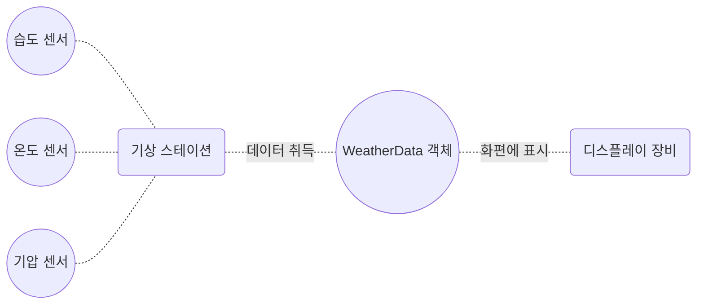
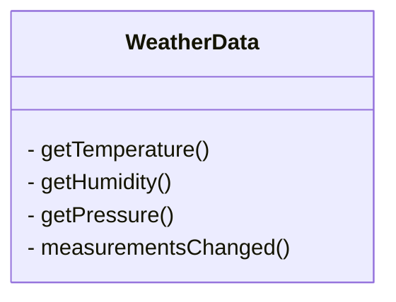

# 옵저버 패턴
- 같이 보기 : [[3-6. 옵서버]]

## 기상 모니터링 애플리케이션


- `weatherData`객체로 현재 조건, 기상 통계, 기상 예보 항목을 디스플레이 장비에 갱신해가는 애플리케이션 제작

## 구현 목표



- 온도, 습도, 기압 값을 새로 받을 때마다 호출되는 `measurementsChanged()`메서드가 동작할 때 디스플레이 화면이 병경되어야 함
	- 새로운 기상 측정 데이터가 들어올 때마다 실행되어야 함
	- 향후 확장성을 고려하여 데이터(디스플레이 요소)를 더하거나 뺄 수 있도록 해야함

```java
public class WeatherData {
	// 인스턴스 변수

	public void measurementsChaned() {
		float temp = getTemperature();
		float humidity = getHumidity();
		float pressure = getPressure();

		currentConditionDisplay.update(temp, humidity, pressure);
		statisticsDisplay.update(temp, humidity, pressure);
		forecastDisplay.update(temp, humidity, pressure);
	}

	// 기타 메소드
}
```

- 변경된 기상 측정 값을 가져오고, 디스플레이의 각 요소를 업데이트 하는 코드
- 구체적인 구현에 맞추어 코딩했으므로, 프로그램을 고치지 않고서는 디스플레이 항목을 추가, 제거할 수 없음

## 옵저버 패턴
- 옵저버 패턴 : 한 객체의 상태가 바뀌면 그 객체에 의존하는 다른 객체에게 연락이 가고, 자동으로 내용이 갱신되는 방식으로 일대다 의존성 정의


- 옵저버 패턴의 구조
	- `Subject` 인터페이스 : 객체에서 옵저버로 등록하거나 탈퇴할 때 이 인터페이스의 메서드 사용
	- `ConcreteSubject` : 주제 역할의 구상 클래스를 사용, 등록 해지용 메소드와 상태가 바귈 때마다 연락하는 메서드 구현
	- `Object` 인터페이스 : 옵저버가 될 가능성이 있는 객체는 이 인터페이스를 구현, 상태가 바뀌었을 때 호출되는 `update`메서드만 있음
	- `ConcreteOjbect` : 객체 인터페이스만 구현하면 무엇이든 옵저버가 될 수 있음

### 느슨한 결합
- 느슨한 결합 : 객체들이 상호작용할 수는 있지만, 서로를 잘 모르는 관계로, 유연성이 좋아짐
- 주제는 옵저버가 특정 인터페이스를 구현한다는 사실만 알고 있고, 옵저버는 언제든지 추가 및 제거할 수 있음
- 새로운 형식의 옵저버를 추가할 때도 주제 변경이 필요 없음
- 주제와 옵저버는 서로 독립적으로 재사용 가능하며, 서로에게 영향을 끼치지 않음

## 기상 스테이션 설계하기


- 기상 스테이션
	- `Subject`인터페이스와 이를 구현한 `WeatherData` 클래스
	- 모든 기상 구성 요소레 `Observer`인터페이스를 구현, 갱신된 데이터를 전달하는 방법 구현
	- 모든 디스플레이 요소에 구현 인터페이스 `DisplayElement`를 생성, 화면을 표시할 메서드 구현
	- 모든 디스플레이항목은 `WeatherData`객체로 부터 얻은 측정값을 활용하여 화면에 표시

```Java
public interface Subject {
	public void registerObserver(Observer o);
	public void removeObserver(Observer o);
	public void notifyObservers();
}

public interface Observer {
	public void update(float temp, float humidity, float pressure);
}

public interface DisplayElement {
	public void display();
}
```

- 인터페이스 구현
	- `Subject`는 옵저버를 등록, 제거하는 메서드와 변경사항을 알리는 메서드
	- `Observer`는 기상 정보가 변경되었을 때 호출될 메서드
	- `DisplayElement`는 화면을 표시할 메서드

```Java
public class WeatherData implements Subject {
	private List<Observer> observers;
	private float temperature;
	private float humidity;
	private float pressure;
	
	public WeatherData() {
		observers = new ArrayList<Observer>();
	}
	public void registerObserver(Observer o) {
		observers.add(o);
	}
	public void removeObserver(Observer o) {
		observers.remove(o);
	}
	public void notifyObservers() {
		for (Observer observer : observers) {
			observer.update(temperature, humidity, pressure);
		}
	}
	public void measurementsChanged() {
		notifyObservers();
	}
	public void setMeasurements(float temperature, float humidity, float pressure) {
		this.temperature = temperature;
		this.humidity = humidity;
		this.pressure = pressure;
		measurementsChanged();
	}

	public float getTemperature() {
		return temperature;
	}
	public float getHumidity() {
		return humidity;
	}
	public float getPressure() {
		return pressure;
	}
}
```

- `Subject` 인터페이스 구현
	- 옵저버 객체를 저장할 ArrayList 생성하고, 옵저버가 추가, 제거될 때 목록에 추가 및 제거
	- 알림을 주는 메서드는 모든 옵저버 객체를 순회하며 각 옵저버의 갱신 메서드 호출

```Java
public class CurrentConditionsDisplay implements Observer, DisplayElement {
	private float temperature;
	private float humidity;
	private WeatherData weatherData;
	
	public CurrentConditionsDisplay(WeatherData weatherData) {
		this.weatherData = weatherData;
		weatherData.registerObserver(this);
	}
	
	public void update(float temperature, float humidity, float pressure) {
		this.temperature = temperature;
		this.humidity = humidity;
		display();
	}
	
	public void display() {
		System.out.println("Current conditions: " + temperature 
			+ "F degrees and " + humidity + "% humidity");
	}
}
```

- 디스플레이 요소 구현
	- `WeatherData` 객체로부터 변경사항을 받기 위해 `Observer`, 디스플레이를 구현하기 위한 `DisplayElement`의 확장(implements)
	- 생성자를 사용 디스플레이를 옵저버로 등록
	- `update()`메서드가 호출되면 값을 저장하고, `display()` 호출

### 푸쉬와 풀 방식
- 기존 방식은 하나의 데이터만 갱신해도 모든 데이터를 내보내도록 하는데, 사용하지 않을 데이터가 포함되어있어도 갱신하게 됨
- 옵저버로 데이터를 보내는 푸시, 옵저버가 주제로부터 데이터를 당겨오는 풀은 구현의 문제이지만, 옵저버가 필요한 데이터를 골라서 가져갈 수 있도록 하는것이 좋음

```Java
public void notifyObservers() {
	for (Observer observer : observers) {
		// 인자 없이 메서드 호출하도록 수정
		observer.update();
	}
}

public interface Observer {
	// 알림 받을 옵저버에서도 매개 변수 없도록 수정
	public void update();
}

public void update() {
	// 값을 갱신할 때 필요한 값을 직접 가져와서 사용
	this.temperature = weatherData.getTemperature();
	this.humidity = weatherData.getHumidity();
	display();
}
```

## 옵저버 패턴의 라이브러리 활용
- JDK의 JavaBean, Swing 라이브러리에서 사용, JS에서의 이벤트, 코코아(Apple OS용 프레임워크)와 스위프트의 옵저빙 프로토콜 등
	- Swing 라이브러리 : Java GUI 툴킷, JButton의 슈퍼클래스 AbstractButton은 리스너를 추가 및 제거하는 메소드를 가짐
	- MVC패턴에서도 사용됨
