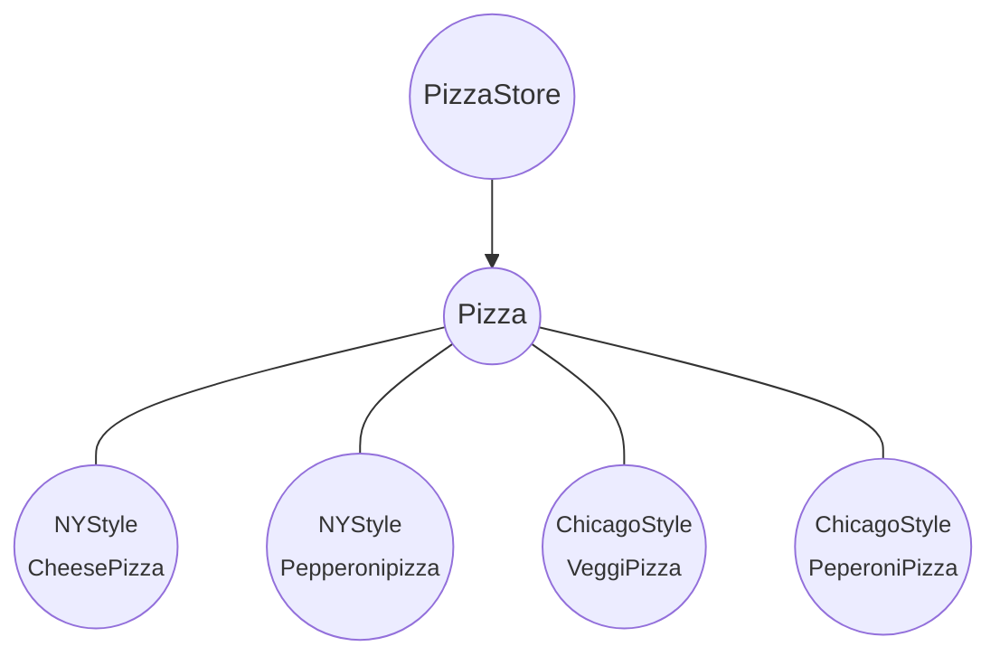

# 추상 팩토리 패턴

## 구상 클래스 의존성 줄이기

### 의존성 뒤집기 원칙 (Dependency Inversion Principle)

- 추상화된 것에 의존하게 만들고 구상 클래스에 의존하지 않게 만든다.

  > ``` mermaid
  > flowchart TD
  > 	A((PizzaStore)) --> B((<font size=2>NYStyle<br>CheesePizza))
  > 	A --> C((<font size=2>NYStyle<br>Pepperonipizza))
  > 	A --> D((<font size=2>ChicagoStyle<br>VeggiPizza))
  > 	A --> E((<font size=2>ChicagoStyle<br>PeperoniPizza))
  > ```
  >
  > 
  >
  > 모든 피자 객체를 PizzaStore가 직접 생성해서, 피자 구상 클래스가 변경되면
  >
  > PizzaStore 까지도 바꿔야 할 수 있으므로, PizzaSotre는 피자클래스 구현에 의존한다고 봄

- 팩토리 메소드 패턴을 적용하면 고수준 구성요소인 PizzaStore와 저수준 구성요소인 피자객체 모두가 추상 클래스인 Pizza에 의존하게 됨



- DIP 원칙 지키기

  - 변수에 구상 클래스의 레퍼런스를 저장하지 않기 

    - new 연산자 대신 팩토리 사용

  - 구상 클래스에서 유도된 클래스를 만들지 않기

    - 인터페이스나 추상 클래스에서 만들기

  - 베이스 클래스에 이미 구현되어 있는 메소드를 오버라이드 하지 않기

    - 베이스 클래스에서 메소드를 정의할 때 모든 서브 클래스에 공유할 수 있는 것만 정의

    

## 원재료 관리

> PizzaStore 프레임워크가 도입되어 체인점들이 미리 정한 절차는 잘 따르나, 몇몇 지점에서 값 싼 원재료를 사용
>
> 원재료의 품질까지 관리할 수 있을까?

- 원재료군을 만들어 파악
  - 제품에 들어가는 재료군(반죽, 소스, 치즈, 토핑)은 같으나 지역마다 재료의 구체적인 내용은 다름


### 원재료 팩토리 만들기

``` java
public interface PizzaIngredientFactory {
  
  public Dough createDough();
	public Sauce createSauce();
	public Cheese createCheese();
	public Veggies[] createVeggies();
	public Pepperoni createPepperoni();
	public Clams createClams();
  
}
```

- 지역별로 팩토리를 만들어 각 생성 메소드를 구현하는 `PizzaIngredientFactory` 를 만들어야 함
- `ReggianoCheese`, `RedPeppers`, `ThickCrustDough`와 같이 팩토리에서 사용할 원재료 클래스들을 구현
- 만든 원재료 공장을 `PizzaStore` 코드에서 사용하도록 함으로써 모든 것을 하나로 묶어줌

``` java
public class NYPizzaingredientFactory implements PizzaIngredientFactory {

	@Override
	public Dough createDough() {
		return new ThinCrustdough();
	}

	@Override
	public Sauce createSauce() {
		return new MarinaraSauce();
	}

	@Override
	public Cheese createCheese() {
		return new ReggianoCheese();
	}

	@Override
	public Veggies[] createVeggies() {
		Veggies veggies[] = { new Farlic(), new Onion(), new Mushroom(), new RedPepper() };
		return veggies;

	}

	@Override
	public Pepperoni createPepperoni() {
		return new SlicedPepperoni();
	}

	@Override
	public Clams createClams() {
		return new Freshclams();
	}

}
```


### Pizza 클래스 변경

```java
public abstract class Pizza {
  // 준비 과정에서 사용하는 원재료들
	String name;
	Dough dough;
	Sauce sauce;
	Veggies veggies[];
	Cheese cheese;
	Pepperoni pepperoni;
	Clams clams;

  // 피자를 만드는 데 필요한 재료를 원재료 팩토리에서 가져오는 추상 메소드
	public abstract void prepare();

  // prepare() 메소드를 제외한 다른 메소드들은 바뀌지 않음
	public void bake() {
		...
	}

	public void cut() {
		..
	}

	...
}
```

- 원재료를 팩토리에서 가져온다는 점 말고는 기존과 달라진 것이 없음


```java
public class CheesePizza extends Pizza {

	PizzaIngredientFactory ingredientFactory;

  // 생성자로부터 피자의 원재료를 제공하는 팩토리를 전달받고 인스턴스 변수에 저장
	public CheesePizza(PizzaIngredientFactory ingredientFactory) {
		this.ingredientFactory = ingredientFactory;
	}

	@Override
	public void prepare() {
    // 인스턴스 변수에 특정 재료의 레퍼런스 대입
    // Pizza 클래스는 원재료 팩토리이기만 하면 어떤 팩토리든 상관하지 않음
		this.dough = ingredientFactory.createDough();
		this.sauce = ingredientFactory.createSauce();
		this.cheese = ingredientFactory.createCheese();
	}

}
```

- 추상 팩토리를 도입하여 코드와 제품을 생산하는 팩토리 분리


### 피자 가게 수정

```java
public class NYPizzaStore extends PizzaStore {

	@Override
	public Pizza createPizza(String type) {

		Pizza pizza = null;
		PizzaIngredientFactory ingredientFactory = new NYPizzaingredientFactory();

		if (type.equals("cheese")) {
			pizza = new CheesePizza(ingredientFactory);
			pizza.setName(ingredientFactory.NY_STYLE + " Cheese Pizza");

		} else if (type.equals("peper")) {
			pizza = new PepperoniPizza(ingredientFactory);
			pizza.setName(ingredientFactory.NY_STYLE + " Pepperoni Pizza");

		} else if (type.equals("clam")) {
			pizza = new ClamPizza(ingredientFactory);
			pizza.setName(ingredientFactory.NY_STYLE + " Clam Pizza");

		} else if (type.equals("veggie")) {
			pizza = new VeggiePizza(ingredientFactory);
			pizza.setName(ingredientFactory.NY_STYLE + " Veggie Pizza");

		}

		return pizza;
	}
}
```


## 추상팩토리 패턴

- 구상 클래스에 의존하지 않고도 서로 연관되거나 의존적인 객체로 이루어진 제품군을 생산하는 인터페이스 제공
- 구상 클래스는 서브 클래스에서 만듦


## 정리

- 애플리케이션을 특정 구현으로부터 분리


### 팩토리 패턴

- 팩토리 패턴은 그 자체로 하나의 객체를 생성하는 역할
- 상속으로 객체 생성. 클래스를 확장하고 팩토리 메소드를 오버라이드 해야 함.
  - 한 제품을 생산하는데 필요한 추상 인터페이스 제공
  - 각 서브 클래스에서 어떤 클래스의 인스턴스를 만들지 결정
- 타입이 다른 다양한 객체를 생성해야할 경우 문제가 생기게 됨


### 추상 팩토리 패턴

- 구성으로 생성. 제품군을 만드는 추상형식 제공
  - 서로 연관된 일련의 제품을 만들 때 주로 사용
- 다양한 요구 사항을 interface 내부에서 메서드로 선언하여 이를 구현하는 클래스에서 처리
  - 새로운 제품을 추가하려면 인터페이스를 바꿔야함
- 그 자체로 사용되는 것이 아닌 다른 객체 내부에서 선언되거나 주입됨
