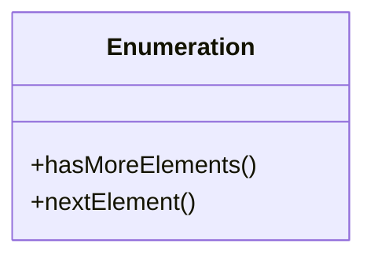
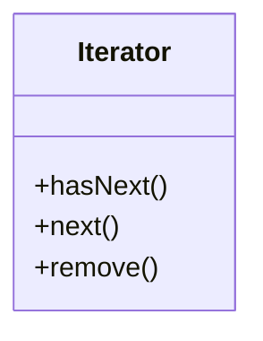
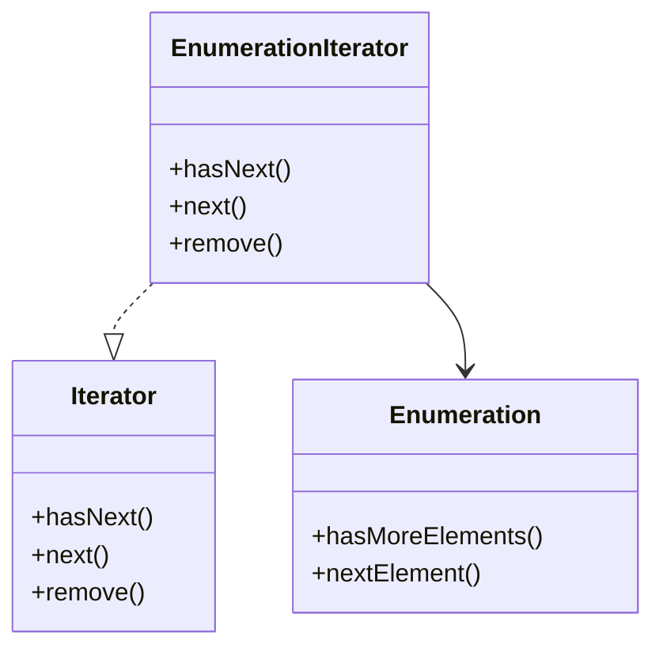

# 어댑터 패턴
- 같이 보기 : [2-1. 어댑터](../디자인%20패턴에%20뛰어들기/2.%20구조%20패턴/2-1.%20어댑터.md)

## 객체지향 어댑터
- 기존 시스템의 출력과 새로 사용하는 시스템의 입력 양식이 다르다면 직접적으로 연결하여 사용할 수 없음
- 이를 해결하기 위하여 이 둘을 연결할 어댑터를 추가할 수 있음

## 어댑터 사용 방법
```Java
public interface Duck {
	public void quack();
	public void fly();
}

public class MallardDuck implements Duck {
	public void quack() {
		System.out.println("꽥");
	}
	public void fly() {
		System.out.println("날고 있어요!!");
	}
}

public interface Turkey {
	public void gobble();
	public void fly();
}

public class WildTurkey implements Turkey {
	public void gobble() {
		System.out.println("골골");
	}
	public void fly() {
		System.out.pringln("짧은 거리를 날고 있어요!");
	}
}
```
- Duck 인터페이스와 이를 구현한 MallardDuck클래스가 있는데, 다른 종류의 조류(칠면조)를 활용하려는 경우, Duck 인터페이스를 활용한 구현이 쉽지 않음

## 오리 어댑터
```Java
public class DuckTestDrive {
	public static void main(Stirng[] args) {
		Duck duck = new MallardDuck(); // 오리
		Turkey turkey = new WildTurkey(); // 칠면조
		Duck turkeyAdapter = new TurkeyAdapter(turkey); // 칠면조 객체를 어댑터로 감싸서 오리 객체처럼 보이게 함

		turkey.gobble();
		// 골골
		...
		testDuck(duck); 
		// 꽥
		// 날고 있어요!!
		...
		testDuck(turkeyAdapter);
		// 골골
		// 짧은 거리를 날고 있어요!
		...
	}
	static void testDuck(Duck duck) {
		duck.quack();
		duck.fly();
	}
}
```

## 어댑터 패턴
- **어댑터 패턴** : 특정 클래스 인터페이스를 클라이언트에서 요구하는 다른 인터페이스로 변환
	- 인터페이스가 호환되지 않아 같이 쓸 수 없었던 클래스를 사용할 수 있게 도와줌


- 어댑터 패턴 구조
	- *클라이언트*는 타겟 인터페이스만 볼 수 있고
	- *어댑터*는 타켓 인터페이스를 구현
	- 모든 처리는 *어댑티*에게 위임되어 작동

### 객체 어댑터와 클래스 어댑터
#### 객체 어댑터

- 객체 합성 원칙을 사용, 한 객체의 인터페이스를 구현하고 다를 객체를 래핑
	- 거의 모든 언어에서 구현 가능

#### 클래스 어댑터

- 다중 상속을 사용하여 인터페이스를 상속하는데, 다중상속을 지원하는 언어에서만 구현 가능

## 어댑터 패턴 적용

- **Enumeration** : Enumeration을 리턴하는 elements() 메소드가 구현되어 있었던 초기 컬렌견 형식(Vector, Stack, Hashtable 등)
	- 컬렉션의 각 항목이 어떻게 관리되는지 신경 쓸 필요 없이 컬렉션의 모든 항목에 접근 가능


- **Iterator** : 최근에는 Enumeration과 마찬가지로 컬렉션에 있는 일련의 항목에 접근하고, 그 항목을 제거할 수 있게 해 주는 Iterator 인터페이스를 쓰기 시작함.
- 구형 코드에서 Enumeration 인터페이스를 사용해야 할 일도 있지만, 새로운 코드에서는 Iterator만 사용하는게 좋음
	- **Iterator**의 `hasNext()`, `next()` 메서드는 **Enumeration**의 `hasMoreElements()`, `nextElement()` 메서드와 대응되지만, `remove()` 메서드는 매칭되지 않음


- 두 인터페이스를 연결하는 **EnumerationIterator** 어댑터를 만들어 해결할 수 있음
	- 다른 두가지 메서드는 쉽게 해결가능해 보이지만, `remove()`메서드는 빠로 해결해주어야 됨

```Java
public class EnumerationIterator implements Iterator<Object> {
	Enumeration<?> enumeration;

	public EnumerationIterator(Enumeraion<?> enumeraion) {
		this.enumeraion = enumeraion;
	}
	public boolean hasNext() {
		return enumeraion.hasMoreElements();
	}
	public Object next() {
		return enumeraion.nextElement();
	}
	public void remove() {
		throw new UnsupportedOperaionException();
		// Iterator의 remove() 메서드는 지원되지 않아 예외를 던지는 방법으로 구현
	}
}
```

## [데코레이터 패턴](Chapter03.%20데코레이터%20패턴.md)과 어댑터 패턴
- 데코레이터 패턴은 인터페이스를 변경하지 않는 반면 어댑터 패턴은 기존 객체 인터페이스를 변경하는 방식으로 동작
