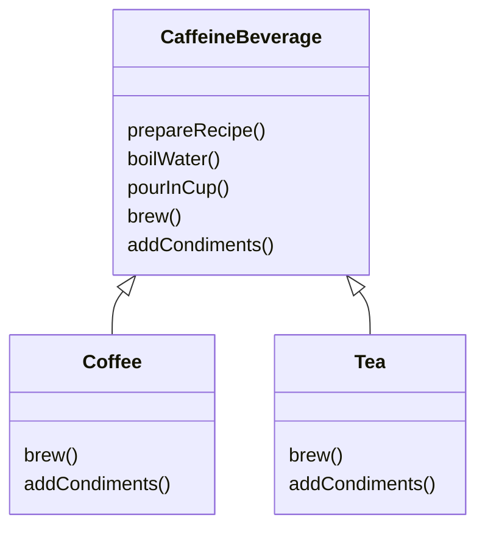

# Chapter 08. 템플릿 메소드 패턴

> 템플릿 메소드 패턴 : https://refactoring.guru/ko/design-patterns/template-method

## Remind

### 1. 문제상황


### 2. 해결책


### 3. 구조


<br>

## 커피와 홍차 만들기

> 매우 비슷한 방법으로 만들어지는 홍차와 커피 제조

### 커피와 홍차를 만드는 과정




### 1. 카페인 음료 (CaffeineBeverage) 코드

#### CaffeineBeverage

```java
public abstract class CaffeineBeverage {
  
    // 템플릿 메소드 (final 로 오버라이드 방지)
	final void prepareRecipe() {
		boilWater();
		brew();
		pourInCup();
		addCondiments();
	}
 
    // Coffee 와 Tea 에서 다른 방식으로 처리 (추상 메소드 선언)
	abstract void brew();
  
	abstract void addCondiments();
 
    // 공통되는 작업
	void boilWater() {
		System.out.println("Boiling water");
	}
  
	void pourInCup() {
		System.out.println("Pouring into cup");
	}
}
```

### 2. 커피, 홍차 (Coffee, Tea) 코드

#### Coffee

```java
public class Coffee extends CaffeineBeverage {
	public void brew() {
		System.out.println("Dripping Coffee through filter");
	}
	public void addCondiments() {
		System.out.println("Adding Sugar and Milk");
	}
}
```

#### Tea

```java
public class Tea extends CaffeineBeverage {
	public void brew() {
		System.out.println("Steeping the tea");
	}
	public void addCondiments() {
		System.out.println("Adding Lemon");
	}
}
```

### 3. 음료 테스트 코드

#### BeverageTestDrive

```java
public class BeverageTestDrive {
	public static void main(String[] args) {
 
		Tea tea = new Tea();
		Coffee coffee = new Coffee();
 
		System.out.println("\nMaking tea...");
		tea.prepareRecipe();
 
		System.out.println("\nMaking coffee...");
		coffee.prepareRecipe();
	}
}
```

> Making tea...
> Boiling water
> Steeping the tea
> Pouring into cup
> Adding Lemon
>
> Making coffee...
> Boiling water
> Dripping Coffee through filter
> Pouring into cup
> Adding Sugar and Milk

<br>

## 후크 활용하기

> **후크(hook)**는 추상 클래스에서 선언되지만 기본적인 내용만 구현되어 있거나 아무 코드도 없는 메소드

- 필수적이지 않은 부분을 <u>선택적</u>으로 서브클래스에서 구현하도록 만들고 싶을 때

  ```java
  abstract class AbstractClass {
      
      final void templateMethod() {
          primitiveOperation1();
          primitiveOperation2();
          concreteOperation();
          hook();
      }
      
      abstract void primitiveOperation1();
      
      abstract void primitiveOperation2();
      
      final void concreteOperation() { // 서브클래스에서 오버라이드 불가
          // concreteOperation() 코드
      }
      
      void hook() {} // 구상 메소드이지만 아무것도 하지 않음 (오버라이드 가능)
  }
  ```

- 추상 클래스에서 진행되는 작업을 서브클래스가 <u>처리할지 말지 결정</u>하는 기능을 부여하고 싶을 때

  > 카페인 음료에 **첨가물을 추가**할지 결정하는 기능

### 1. 카페인 음료 (CaffeineBeverage) 코드 수정

#### CaffeineBeverageWithHook

```java
public abstract class CaffeineBeverageWithHook {
 
	final void prepareRecipe() {
		boilWater();
		brew();
		pourInCup();
		if (customerWantsCondiments()) {
			addCondiments();
		}
	}
 
	abstract void brew();
 
	abstract void addCondiments();
 
	void boilWater() {
		System.out.println("Boiling water");
	}
 
	void pourInCup() {
		System.out.println("Pouring into cup");
	}
 
    // 첨가물 추가 실행 여부를 판별 (오버라이드 가능한 hook)
	boolean customerWantsCondiments() {
		return true;
	}
}
```

### 2. 커피, 홍차 (Coffee, Tea) 코드 수정

#### CoffeeWithHook

```java
public class CoffeeWithHook extends CaffeineBeverageWithHook {
 
	public void brew() {
		System.out.println("Dripping Coffee through filter");
	}
 
	public void addCondiments() {
		System.out.println("Adding Sugar and Milk");
	}
 
	public boolean customerWantsCondiments() {

		String answer = getUserInput();

        // 사용자의 입력값에 따라 boolean 반환
		if (answer.toLowerCase().startsWith("y")) {
			return true;
		} else {
			return false;
		}
	}
 
    // 사용자의 입력값을 받아 return 하는 메소드 (y/n)
	private String getUserInput() {
		String answer = null;

		System.out.print("Would you like milk and sugar with your coffee (y/n)? ");

		BufferedReader in = new BufferedReader(new InputStreamReader(System.in));
		try {
			answer = in.readLine();
		} catch (IOException ioe) {
			System.err.println("IO error trying to read your answer");
		}
		if (answer == null) {
			return "no";
		}
		return answer;
	}
}
```

#### TeaWithHook

```java
public class TeaWithHook extends CaffeineBeverageWithHook {
 
	public void brew() {
		System.out.println("Steeping the tea");
	}
 
	public void addCondiments() {
		System.out.println("Adding Lemon");
	}
 
    // 사용자의 입력값에 따라 boolean 반환
	public boolean customerWantsCondiments() {

		String answer = getUserInput();

		if (answer.toLowerCase().startsWith("y")) {
			return true;
		} else {
			return false;
		}
	}
 
    // 사용자의 입력값을 받아 return 하는 메소드 (y/n)
	private String getUserInput() {
		String answer = null;

		System.out.print("Would you like lemon with your tea (y/n)? ");

		BufferedReader in = new BufferedReader(new InputStreamReader(System.in));
		try {
			answer = in.readLine();
		} catch (IOException ioe) {
			System.err.println("IO error trying to read your answer");
		}
		if (answer == null) {
			return "no";
		}
		return answer;
	}
}
```

### 3. 음료 테스트 코드 수정

#### BeverageTestDrive

```java
public class BeverageTestDrive {
	public static void main(String[] args) {

		TeaWithHook teaHook = new TeaWithHook();
		CoffeeWithHook coffeeHook = new CoffeeWithHook();
 
		System.out.println("\nMaking tea...");
		teaHook.prepareRecipe();
 
		System.out.println("\nMaking coffee...");
		coffeeHook.prepareRecipe();
	}
}
```

> Making tea...
> Boiling water
> Steeping the tea
> Pouring into cup
> Would you like lemon with your tea (y/n)? y
> Adding Lemon
>
> Making coffee...
> Boiling water
> Dripping Coffee through filter
> Pouring into cup
> Would you like milk and sugar with your coffee (y/n)? n

<br>

## 할리우드 원칙 (Hollywood Principle)

> 먼저 연락하지 마세요. 저희가 연락 드리겠습니다.

- **의존성 부패(dependency rot)**를 방지할 수 있음
  - 고수준/저수준 구성 요소가 서로 의존하며 의존성이 복잡하게 꼬이는 상황을 방지
- 저수준 구성 요소가 시스템에 접속할 수는 있지만, 어떻게 구성 요소를 사용할지는 **고수준 구성 요소**가 결정


<br>

## 참고자료

- https://www.javaguides.net/2018/07/template-pattern-from-head-first-design-patterns.html
- http://thephantomprogrammer.blogspot.com/2015/08/the-hollywood-principle-dont-call-us.html