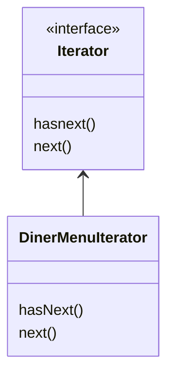
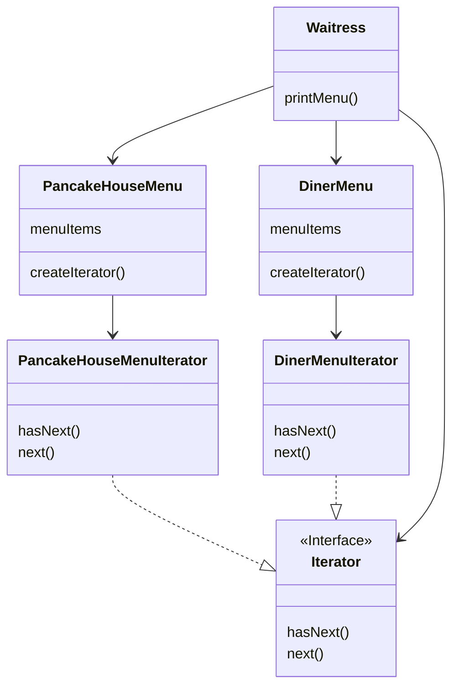
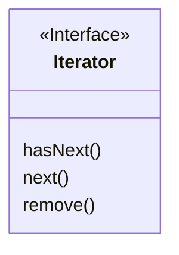
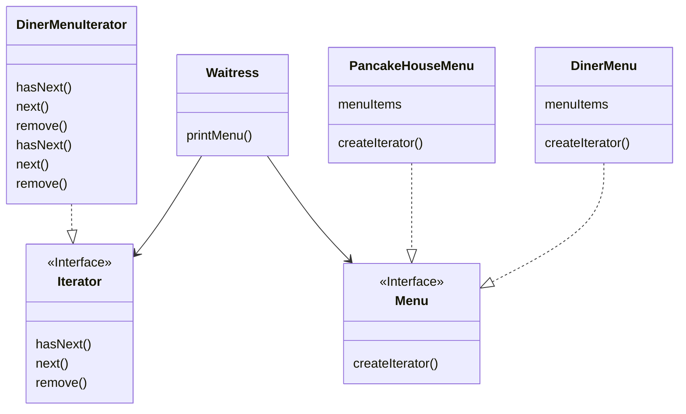
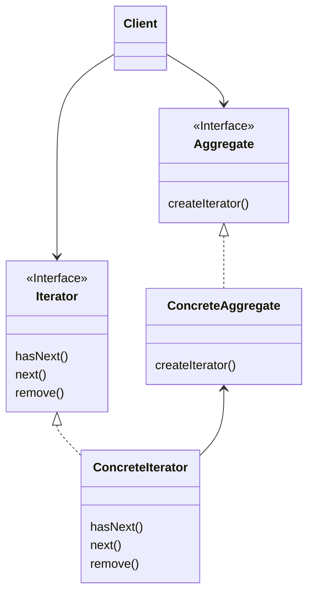

# 반복자, 컴포지트 패턴

## 문제 상황

- 서로 다른 메뉴를 파는 팬케이크 가게와 식당이 합병하여 메뉴를 보여주는 상황에서 문제가 생김
- 메뉴 항목을 나타내는 MenuItem 클래스를 사용하나 구현방식이 다름

``` java
public class PancakeHouseMenu{ // 팬케이크 가게의 메뉴 구현 방식
  // 메뉴 항목을 쉽게 추가하기 위해 ArrayList 사용
  List<MenuItem> menuItems;
  
  ...
  
  public ArrayList getMenuItems(){
    return menuItems;
  }
  
  ...
}
```

``` java
public class DinerMenu{ // 식당의 메뉴 구현 방식
  // 메뉴에 들어가는 항목의 최대 개수를 제한하고 진짜 배열 사용
  static final int MAX_ITEMS = 6;
  MenuItem[] menuItems;
  
  ...
    
  public MenuItem[] getMenuItems(){
    return menuItems;
  }
}
```

``` java
public class Waitress { // 메뉴가 다른 식으로 구현되어 있으므로 두 개의 서로 다른 순환문을 만들어야 함
  ...
  for (int i = 0; i < breakfastItems.size(); i++) {
    MenuItem menuItem = (MenuItem) breakfastItems.get(i);
  }
  for (int i = 0; i < lunchItems.length; i++){
    MenuItem menuItem = lunchItems[i];
  }
}

```


## 반복을 캡슐화 하기

- 바뀌는 부분을 캡슐화 => 반복 처리 작업을 캡슐화한  `Iterator` 라는 객체를 만들어 적용하기



- `hasNext()` 메소드를 사용하여 반복 작업을 적용할 대상이 더 있는지 확인
- `next()` 메소드는 다음 객체를 리턴

``` java
public interface Iterator {
  boolean hasNext();
  MenuItem next();
}
```

``` java
public class DinerMenuIterator implements Iterator {
  MenuItem[] items;
  int position = 0; // 반복작업이 처리되고 있는 위치 저장
  
  public DinerMenuIterator(MenuItem[] items) { // 반복 작업을 수행할 메뉴 항목 배열을 받음
    this.items = items;
  }
  
  public MenuItem next(){
    MenuItem menuItem = item[position];
    position = position + 1;
    return menuItem;
  }
  
  public boolean hasNext() {
    if (position >= items.length || items[position] == null){
      return false;
    } else {
      return true;
    }
  }
}
```

``` java
public class DinerMenu{
 
// 더 이상 필요 없음. 내부 구조를 다 드러내는 단점이 있어서 없애는 게 나음.
//public MenuItem[] getMenuItems(){
//  return menuItems;
//}
  
  // menuItems 배열로 DinerMenuIterator를 생성한 다음 클라이언트에게 리턴
  // 반복자로 메뉴에 들어있는 하나하나의 항목에만 접근 할 수 있으면 어떻게 관리 되는지 알 필요 x
  public Iterator createIterator() {
    return new DinerMenuIterator(menuItems);
  }
}
```

``` java
public class Waitress {
  
  PancakeHouseMenu pankcakeHouseMenu;
  DinerMenu dinermenu;
  
  ...
  
  public void printMenu(){
    Iterator pancakeIterator = pancakeHouseMenu.createIterator();
    Iterator dinerIterator = dinerMenu.createIterator();
    
    printMenu(pancakeIterator);
    printMenu(dinerIterator);
  }
  
  // 이제 순환문이 하나만 있어도 됨
  private void printMenu(Iterator iterator){
    while(iterator.hasNext()){
      MenuItem menuItem = iterator.next();
      // 출력
    }
  }
}
```



- `PancakeHouseMenu` 와 `DinerMenu` 에서는 `createIterator()` 메소드 구현. 이는 각 메뉴 항목의 반복자를 만들어 줌
- `PancackeHouseMenuIterator` 와 `DinerMenuIterator` 는 `Iterator` 인터페이스를 구현
- `Iterator` 덕분에 `Waitress` 클래스가 구상 클래스로부터 분리 되어 더이상 Menu의 구현 방법을 신경쓰지 않아도 됨
- 반복자를 이용하면, 여러 메소드를 외부에 노출하지 않으며 컬렉션에 들어있는 모든 객체에 접근 할 수 있음
  - 반복자를 구현한 코드를 컬렉션 밖으로 끄집어 낼 수 있음 (반복 작업을 캡슐화)

- `PancakeHouseMenu`와 `DinerMenu` 에서 <u>똑같은 메소드를 제공하지만 같은 인터페이스를 구현하고 있지는 않음</u>


## 인터페이스 개선하기

- 자바에 있는 `Iterator` 인터페이스(java.util.Iterator)를 사용하기



- ArrayList에 반복자를 리턴하는 iterator() 메소드가 있어 별도의 Iterator를 사용하지 않아도 됨

``` java
public class PancakeHouseMenu {
  ...
    
  // PankcackeHouseMenuIterator는 이제 더이상 사용하지 않음
  public Iterator<MenuItem> createIterator(){
    return menuItems.iterator();
  }
}
```

- 배열을 사용하는 `DinerMenu`의 경우 따로 반복자를 구현해야 함

```java
import java.util.Iterator;

publc class DinerMenuIterator implements Iterator<MenuItem> {
  ...
  
  public void remove(){
    // Iterator 인터페이스에서 remove() 메서드는 필수가 아니므로 오버라이드 해줌
  }
}
```

- 메뉴 인터페이스 통일

```java
public interface Menu{
  // 클라이언트에서 메뉴에 들어있는 항목의 반복자를 획득할 수 있게 해주는 간단한 인터페이스
  public Iterator<MenuItem> createIterator();
}
```

- Waitress

``` java
public class Waitress {
  // 구상 메뉴 클래스를 Menu 인터페이스로 통일
  Menu pankcakeHouseMenu;
  Menu dinermenu;
  
  ...
}
```

### 최종 클래스 다이어그램



- `Waitress` 클래스는 `Menu`와 `Iterator` 만 신경 쓰면 됨
- `DinerMenu`와 `PankcakeMenu`는 `Menu` 인터페이스를 구현하고 각 Iterator 클래스는 반복자를 생성하기 위해 `Iterator` 인터페이스 구현


## 반복자 패턴 정리

- 반복자 패턴은 컬렉션의 구현 방법을 노출하지 않으면서 집합체 내의 모든 항목에 접근하는 방법을 제공한다.



- `Aggregate` 라는 공통된 인터페이스가 있으면 클라이언트는 편리하게 작업을 처리할 수 있음
- `ConcreteAggregate` 에는 객체 컬렉션이 들어 있으며, 그 안에 들어 있는 컬렉션을 Iterator로 리턴하는 메소드 구현
- `Iterator` 인터페이스는 모든 반복자가 구현해야하는 인터페이스를 제공. 컬렉션에 들어있는 원소에 접근할 수 있는 메소드 제공
- `ConcereteIterator` 는 반복 작업 중에 현재 위치 관리


## 단일 역할 원칙

- 어떤 클래스가 바뀌는 이유는 하나뿐이어야 한다.
  - 어떤 클래스에서 맡고 있는 모든 역할은 나중에 코드 변화를 불러올 수 있으므로, 한 클래스에서는 한 가지 역할만 맡도록 함

- 응집도(cohesion)
  - 한 클래스 또는 모듈이 특정 목적이나 역할을 얼마나 일관되게 지원하는지를 나타내는 척도
  - 응집도가 낮다는 건 서로 관련 없는 기능이 묶여있다는 것


## Q&A

### 내부 반복자와 외부 반복자

- 지금 사용하는 것은 클라이언트가 next() 를 호출해서 다음 항목을 가져오므로 외부 반복자임

- 내부 반복자는 반복자 자신이 반복 작업을 제어하므로 모든 원소를 대상으로 어떤 일을 해야하는 지 알려 줘야 함


### 해시테이블 같은 순서가 없는 컬렉션의 반복 작업 순서

- 반복자에는 특별한 순서가 정해져 있지 않음. 접근 순서는 사용된 컬렉션의 특성 및 구현과 관련되어 있음
- 컬렉션 문서에 언급이 되어 있지 않은 이상 순서를 가정하면 안 됨


---


## 종업원 코드 개선하기

- 메뉴 종류 만큼 printMenu()를 호출하고, 새로운 메뉴가 추가될 때마다 코드를 추가해야 함
  - OCP(Open Closed Principle)에 위배
  - 메뉴를 독립적인 객체로 다루고 있어서 일어난 문제
- 서브 메뉴 추가나 기타 변경에 자유롭지 못함
- 새로운 디자인에 필요한 것
  - 메뉴, 서브메뉴, 메뉴항목을 모두 넣을 수 있는 트리 형태의 구조가 필요
  - 모든 항목을 대상으로 유연한 반복작업이 가능


## 컴포지트 패턴

- 객체를 트리구조로 구성해서 부분-전체 계층구조를 구현
- 클라이언트에서 개별 객체와 복합 객체를 똑같은 방법으로 다룰 수 있음
  - 복합 객체(composite)에는 구성 요소(component)가 들어 있음 (재귀적)
  - 구성 요소는 복합 객체 / 잎(leaf)로 나뉠 수 있음


## 패턴 적용하기

- 구성 요소 인터페이스 MenuComponent 생성
  - Menu와 MenuItem 에서 모두 사용
  - Menu와 MenuItem은 MenuComponent 추상 클래스에서 쓰일만한 메소드만 오버라이딩해서 사용

``` java
public abstract class MenuComponent{
  //MenuComponent를 추가, 제거, 가져오기 위한 메소드
  public void add(MenuComponent menuComponent){
    throw new UnsupportedOperationException();
  }
  public void remove(MenuComponent menuComponent){
    throw new UnsupportedOperationException();
  }
  public MenuComponent getChild(int i){
    throw new UnsupportedOperationException();
  }
    
  // MenuItem에서 작업을 처리하기 위해 사용하는 메소드
  // 이 중 몇 개는 Menu에서 사용할 수 있음
  // 잎과 노드는 역할이 다르므로 오버라이딩 하지 않으면 예외를 던지는 코드 기본 구현
  public String getName(){
    throw new UnsupportedOperationException();
  }
  public String getDescription(){
    throw new UnsupportedOperationException();
  }
  public double getPrice(){
    throw new UnsupportedOperationException();
  }
  public boolean isVegetarian(){
    throw new UnsupportedOperationException();
  }
    
  //모든 구성요소에서 구현하는 메소드
  public void print(){
    throw new UnsupportedOperationException();
  }
}
```

- MenuItem 클래스 만들기
  - MeunuItem은 잎에 해당하는 클래스이며, 복합 객체의 원소에 해당하는 행동을 구현해야 함

```java
//MenuComponent 상속
public MenuItem extends MenuComponent{
  String name;
  String description;
  boolean vegetarian;
  double price;
    
    // 생성자와 getter 메소드는 기존과 동일
  public MenuItem(String name, String description, boolean vegetarian, double price){
    ...
  }
    
  public String getName(){
    return name;
  }
  
  public String getDescription(){
    return description;
  }
  
  public double getPrice(){
    return price;
  }
  
  public boolean isVegetarian(){
    return vegetarian;
  }
    
  public void print(){
    System.out.print("  " + getName());
      if(isVegetarian()){
        System.out.print("(v)");
      }
      System.out.print(", " + getPrice());
      System.out.println("  --" + getDescription());
  }
}
```

- 메뉴 구현하기

``` java
//마찬가지로 MenuComponent 상속
public class Menu extends MenuComponent{
  ArrayLisst menuComponents = new ArrayList();
  String name;
  String description;
    
  public Menu(String name, String description){
    ...
  }
    
  public void add(MenuComponent menuComponent){
  	menuComponents.add(menuComponent);
  }
  public void remove(MenuComponent menuComponent){
    menuComponents.remove(menuComponent);
  }
  public void MenuComponent(int i){
    return (MenuComponent)menuComponents.get(i);
  }
    
    
  //getter 구현, 필요 없는 메소드는 구현하지 않음
  public String getName(){
    ...
  }
  public String getDescription(){
    ...
  }
    
  //Menu 클래스에선 해당 메뉴에 속하는 모든 서브 Menu와 MenuItem을 출력해줘야함
  //반복자를 사용해 각 자식의 print() 호출
  public void print(){
    ...
        
    Iterator iterator = menuComponents.iterator();
    
    while(iterator.hasNext()){
      MenuComponent menuComponent = (MenuComponent)iterator.next();
      menuComponent.print();
    }
	}
}
```

- Waitress 수정

``` java
public class Waitress{
  MenuComponent allMenus;
    
  // 다른 모든 메뉴를 포함하고 있는 최상위 메뉴 구성 요소만 넘겨주면 됨
  public Waitress(MenuComponent allMenus){
    this.allMenus = allMenus;
  }
    
  // 전체 계층구조를 출력하고 싶다면 최상위 메뉴의 print() 호출
  public void printMenu(){
		allMenus.print();
  }
}
```


### 짚고 넘어가기

- 한 클래스에서 한 역할만 맡아하는데, 컴포지트 패턴에서는 계층 구조를 관리하는 것과 메뉴 관련 작업이라는 두 가지 역할을 한 클래스에서 처리하고 있는 것 아닌가?
  - 컴포지트 패턴은 단일 역할 원칙을 깨면서 투명성을 확보하기 위한 패턴
  - Component 인터페이스에 자식들을 관리하는 기능과 잎으로써의 기능을 전부 넣어서 클라이언트가 복합 객체와 잎을 똑같은 방식으로 처리할 수 있도록 함
  - 안정성이 떨어짐 (클라이언트가 무의미하거나 부적절한 작업을 처리할 수 있음)

