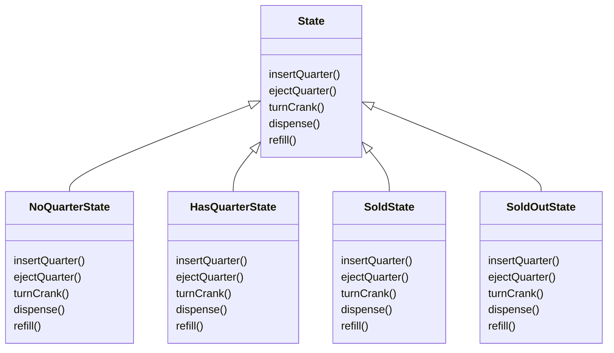

# Chapter 10. 상태 패턴

> 상태 패턴 : https://refactoring.guru/ko/design-patterns/state

## Remind

### 1. 문제상황


```java
class Document is
    field state: string
    // …
    method publish() is
        switch (state)
            "draft":
                state = "moderation"
                break
            "moderation":
                if (currentUser.role == "admin")
                    state = "published"
                break
            "published":
                // Do nothing.
                break
    // …
```

### 2. 해결책


### 3. 구조


<br>

## 최첨단 뽑기 기계

> 특정한 상태에 따라 다르게 동작하는 뽑기 기계 개발

- **상태 :** 동전 없음 (기본값), 동전 있음, 알맹이 판매, 알맹이 매진

### 뽑기 기계의 기본 동작




### 1. State 클래스 구현

#### State 인터페이스

```java
public interface State {
 
    // 뽑기 기계에서 일어날 수 있는 행동들
	public void insertQuarter(); // 동전 넣기
	public void ejectQuarter(); // 동전 빼기
	public void turnCrank(); // 손잡이 돌리기
	public void dispense(); // 알맹이 내보내기
	public void refill(); // 알맹이 채우기
}
```

> 인터페이스 대신 **추상 클래스**를 사용하여 공통적인 기능을 넣을 수도 있음

#### NoQuarterState (동전 없음)

```java
public class NoQuarterState implements State {
    GumballMachine gumballMachine; // 기계 레퍼런스 인스턴스 변수
 
    // 생성자로부터 기계의 레퍼런스 전달
    public NoQuarterState(GumballMachine gumballMachine) {
        this.gumballMachine = gumballMachine;
    }
 
	public void insertQuarter() {
		System.out.println("You inserted a quarter");
        // 기계의 상태 전환 (구성 상태에서 변경)
		gumballMachine.setState(gumballMachine.getHasQuarterState());
	}
 
	public void ejectQuarter() {
		System.out.println("You haven't inserted a quarter");
	}
 
	public void turnCrank() {
		System.out.println("You turned, but there's no quarter");
	 }
 
	public void dispense() {
		System.out.println("You need to pay first");
	} 
	
	public void refill() { }
 
	public String toString() {
		return "waiting for quarter";
	}
}
```

#### HasQuarterState (동전 있음)

```java
public class HasQuarterState implements State {
	GumballMachine gumballMachine;
 
	public HasQuarterState(GumballMachine gumballMachine) {
		this.gumballMachine = gumballMachine;
	}
  
	public void insertQuarter() {
		System.out.println("You can't insert another quarter");
	}
 
	public void ejectQuarter() {
		System.out.println("Quarter returned");
		gumballMachine.setState(gumballMachine.getNoQuarterState());
	}
 
	public void turnCrank() {
		System.out.println("You turned...");
		gumballMachine.setState(gumballMachine.getSoldState());
	}

    public void dispense() {
        System.out.println("No gumball dispensed");
    }
    
    public void refill() { }
 
	public String toString() {
		return "waiting for turn of crank";
	}
}
```

#### SoldState (알맹이 판매)

```java
public class SoldState implements State {
 
    GumballMachine gumballMachine;
 
    public SoldState(GumballMachine gumballMachine) {
        this.gumballMachine = gumballMachine;
    }
       
	public void insertQuarter() {
		System.out.println("Please wait, we're already giving you a gumball");
	}
 
	public void ejectQuarter() {
		System.out.println("Sorry, you already turned the crank");
	}
 
	public void turnCrank() {
		System.out.println("Turning twice doesn't get you another gumball!");
	}
 
	public void dispense() {
        // 알맹이가 나오도록 기계를 동작
		gumballMachine.releaseBall();
        // 남은 알맹이 갯수에 따라 변경되는 상태가 달라짐
		if (gumballMachine.getCount() > 0) {
			gumballMachine.setState(gumballMachine.getNoQuarterState());
		} else {
			System.out.println("Oops, out of gumballs!");
			gumballMachine.setState(gumballMachine.getSoldOutState());
		}
	}
	
	public void refill() { }
 
	public String toString() {
		return "dispensing a gumball";
	}
}
```

> 상태 전환이 <u>동적으로 결정</u>되는 경우 **상태 클래스**에서 상태 전환을 처리하는 것이 좋음

#### SoldOutState (알맹이 매진)

```java
public class SoldOutState implements State {
    GumballMachine gumballMachine;
 
    public SoldOutState(GumballMachine gumballMachine) {
        this.gumballMachine = gumballMachine;
    }
 
	public void insertQuarter() {
		System.out.println("You can't insert a quarter, the machine is sold out");
	}
 
	public void ejectQuarter() {
		System.out.println("You can't eject, you haven't inserted a quarter yet");
	}
 
	public void turnCrank() {
		System.out.println("You turned, but there are no gumballs");
	}
 
	public void dispense() {
		System.out.println("No gumball dispensed");
	}
	
    // 알맹이 매진 상태인 경우에만 refill 가능
	public void refill() { 
		gumballMachine.setState(gumballMachine.getNoQuarterState());
	}
 
	public String toString() {
		return "sold out";
	}
}
```

### 2. 뽑기 기계 (GumballMachine) 구현

#### GumballMachine

```java
public class GumballMachine {
 
    // 상태에 대한 인스턴스 변수 (상태 객체 생성 및 대입은 생성자에서 처리)
	State soldOutState;
	State noQuarterState;
	State hasQuarterState;
	State soldState;
 
	State state;
	int count = 0;
 
	public GumballMachine(int numberGumballs) {
        // 상태 객체를 생성하고 인스턴스 변수에 대입
		soldOutState = new SoldOutState(this);
		noQuarterState = new NoQuarterState(this);
		hasQuarterState = new HasQuarterState(this);
		soldState = new SoldState(this);

        // 알맹이의 초기 개수도 생성자에서 처리
		this.count = numberGumballs;
 		if (numberGumballs > 0) {
			state = noQuarterState;
		} else {
			state = soldOutState;
		}
	}
 
    // 현재 상태가 행동에 대한 작업을 처리
	public void insertQuarter() {
		state.insertQuarter();
	}
 
	public void ejectQuarter() {
		state.ejectQuarter();
	}
 
	public void turnCrank() {
		state.turnCrank();
        // dispense() 메소드를 구현하지 않고 내부에서 처리 (사용자가 직접 요청하지 않아도 됨)
		state.dispense();
	}
 
	void releaseBall() {
		System.out.println("A gumball comes rolling out the slot...");
		if (count > 0) {
			count = count - 1;
		}
	}
 
	int getCount() {
		return count;
	}
 
	void refill(int count) {
		this.count += count;
		System.out.println("The gumball machine was just refilled; its new count is: " + this.count);
		state.refill();
	}

    // State 를 비롯한 다른 객체에서 뽑기 기계의 상태를 전환할 수 있음
	void setState(State state) {
		this.state = state;
	}
    public State getState() {
        return state;
    }

    public State getSoldOutState() {
        return soldOutState;
    }

    public State getNoQuarterState() {
        return noQuarterState;
    }

    public State getHasQuarterState() {
        return hasQuarterState;
    }

    public State getSoldState() {
        return soldState;
    }
 
	public String toString() {
		StringBuffer result = new StringBuffer();
		result.append("\nMighty Gumball, Inc.");
		result.append("\nJava-enabled Standing Gumball Model #2004");
		result.append("\nInventory: " + count + " gumball");
		if (count != 1) {
			result.append("s");
		}
		result.append("\n");
		result.append("Machine is " + state + "\n");
		return result.toString();
	}
}
```

> Context 에서 상태 전환을 처리해도 문제가 생기지는 않음 (but. 되도록 상태 클래스에서 처리)

### 3. 뽑기 기계 테스트 코드

#### GumballMachineTestDrive

```java
public class GumballMachineTestDrive {

	public static void main(String[] args) {
		GumballMachine gumballMachine = new GumballMachine(2);

		System.out.println(gumballMachine);

		gumballMachine.insertQuarter();
		gumballMachine.turnCrank();

		System.out.println(gumballMachine);

		gumballMachine.insertQuarter();
		gumballMachine.turnCrank();
		gumballMachine.insertQuarter();
		gumballMachine.turnCrank();
		
		gumballMachine.refill(5);
		gumballMachine.insertQuarter();
		gumballMachine.turnCrank();

		System.out.println(gumballMachine);
	}
}
```

> Mighty Gumball, Inc.
> Java-enabled Standing Gumball Model #2004
> Inventory: 2 gumballs
> Machine is waiting for quarter
>
> You inserted a quarter
> You turned...
> A gumball comes rolling out the slot...
>
> Mighty Gumball, Inc.
> Java-enabled Standing Gumball Model #2004
> Inventory: 1 gumball
> Machine is waiting for quarter
>
> You inserted a quarter
> You turned...
> A gumball comes rolling out the slot...
> Oops, out of gumballs!
> You can't insert a quarter, the machine is sold out
> You turned, but there are no gumballs
> No gumball dispensed
> The gumball machine was just refilled; its new count is: 5
> You inserted a quarter
> You turned...
> A gumball comes rolling out the slot...
>
> Mighty Gumball, Inc.
> Java-enabled Standing Gumball Model #2004
> Inventory: 4 gumballs
> Machine is waiting for quarter

- **클라이언트**에서 Context 의 상태를 직접 변경해서는 안됨

<br>

## 상태 패턴 vs 전략 패턴

### 상태 패턴

- 미리 정해진 **상태 전환 규칙**에 따라 Context 객체/State 에서 상태를 변경

  > 뽑기 기계의 상태를 정해진 전환 규칙에 따라 <u>뽑기 기계/상태</u>에서 변경

### 전략 패턴

- 클라이언트에서 원하는 방식으로 Context 객체의 상태를 변경

  > <u>클라이언트</u>가 오리의 인스턴스 중 **진짜 오리**에게는 '꽥꽥', **고무 오리**에게는 '삑삑' 소리내는 행동을 부여

<br>

## 참고자료

- https://toihocdesignpattern.com/chuong-10-state-pattern-trang-thai-van-vat.html