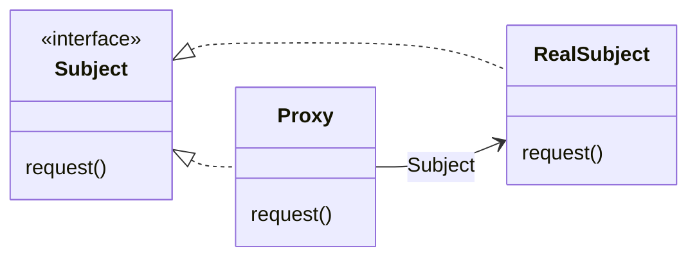
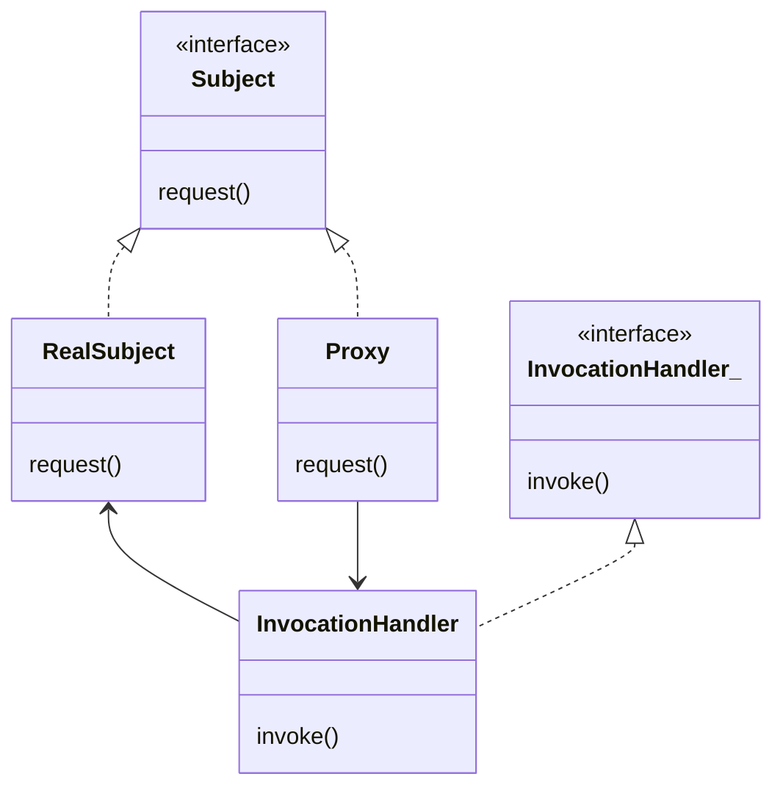

# 프록시 패턴

## 프록시 패턴(Proxy Pattern)이란

- 특정 객체로의 접근을 제어하는 대리인(특정 객체를 대변하는 객체)를 제공하는 패턴
- 프록시에서 접근을 제어 하는 방법
  - 원격 프록시를 써서 원격 객체로의 접근을 제어할 수 있음
  - 가상 프록시(virtual proxy)를 써서 생성하기 힘든 자원으로의 접근을 제어할 수 있음
  - 보호 프록시(protection proxy)를 써서 접근 권한이 필요한 자원(보안이 중요한 객체)으로의 접근을 제어할 수 있음



- **RealSubject** : 진짜 작업을 처리하는 객체
- **Proxy** : RealSubject의 레퍼런스가 들어있어서, 진짜 객체가 필요한 경우 레퍼런스를 사용해 요청을 전달. Proxy에서 RealSubject의 인스턴스를 생성하거나, 그 객체의 생성 과정에 관여하는 경우가 많음
- **Subject** : RealSubject와 Proxy 모두 Subject 인터페이스를 구현해서 어떤 클라이언트든 동일하게 다룰 수 있음


## 원격 프록시

- 원격 객체의 **로컬 대변자 역할**
  - 원격 객체 : 다른 주소 공간에서 돌아가고 있는 객체
  - 로컬 대변자 : 어떤 메소드를 호출하면, 다른 원격 객체에게 그 메소드 호출을 전달해 주는 객체

- 클라이언트 객체는 원격 객체의 메소드 호출을 하는 것처럼 행동하지만 실제로는 로컬 힙에 들어가 있는 '프록시' 객체의 메소드를 호출
- 네트워크 통신과 관련된 저수준 작업은 이 프록시 객체에서 처리


### 원격 메소드의 기초


- **클라이언트 객체** 는 진짜 서비스의 메소드를 호출한다고 생각. 클라이언트 보조 객체에서 실제로 원하는 작업을 처리한다
- **클라이언트 보조 객체** 는 진짜 서비스인 척하고 있지만, 실제로는 객체의 프록시
- **서비스 보조 객체**는 클라이언트 보조 객체로부터 요청을 받음. 받은 요청을 해석해서 진짜 서비스에 있는 메소드 호출
- **서비스 객체** 가 진짜 서비스로, 실제로 작업을 처리하는 메소드가 들어 있음


### 자바 RMI

- 클라이언트 보조 객체와 서비스 보조 객체를 만들어 줌. 보조 객체에는 원격 서비스와 똑같은 메소드가 들어 있음
- RMI를 사용하면 네트워킹 및 입출력 관련 코드를 작성하지 않고, 같은 로컬 JVM 메소드를 호출하듯이 원격 메소드를 호출할 수 있음
  - 네트워킹 입출력을 쓸 때는 위험이 따르므로 대비해야 함
- 원격 객체를 찾아서 접근할 때 쓸 수 있는 룩업 서비스도 제공

- 클라이언트 보조 객체는 스텁(Stub), 서비스 보조 객체는 스켈레톤(Skeleton)이라고 부름


### 원격 서비스 만들기

#### 1. 원격 인터페이스 만들기

- 클라이언트가 원격으로 호출할 메소드 정의
- 클라이언트에서 이 인터페이스를 서비스의 클래스 형식으로 사용하며, 스텁과 실제 서비스에 이 인터페이스를 구현

``` java
// java rmi Remote 확장
import java.rmi.*;

public interface MyRemote extends Remote {
  // 모든 메소드를 RemoteException 던지는 메소드로 선언
  // 인자와 리턴값은 반드시 primitive type이거나 Serializable 형식으로 선언
  public String sayHello() throws RemoteException;
}
```


#### 2. 서비스 구현 클래스 만들기

- 실제 작업을 처리하는 클래스로 원격 메소드를 실제로 구현한 코드가 있음
- 나중에 클라이언트에서 이 객체에 있는 메소드 호출

``` java
// UnicastRemoteObject 를 확장
public class MyRemoteImpl extends UnicastRemoteObject implements MyRemote {
  
  private static final long serialVersionUID = 1L;
  
  // RemoteException을 선언하는 생성자 구현
  public MyRemoteImpl() throws RemoteException {}
  
  // 서비스 클래스에 원격인터페이스 구현
  public String SayHello(){
    return "Server Say Hi";
  }
}
```

``` java
try {
  // 서비스 인스턴스를 만들고
  MyRemote service = new MyRemoteImpl();
  // 서비스를 RMI 레지스트리에 등록
  Naming.rebind("RemoteHello", service);
} catch(Exception ex) {}
```


#### 3. RMI 레지스트리 실행하기

- 전화번호부와 비슷하며 클라이언트는 이 레지스트리로부터 프록시(=스텁=클라이언트 보조 객체)를 받아감

```
rmiregistry
```


#### 4. 원격 서비스 실행하기

- 클라이언트에서 RMI 레지스트리를 룩업하면 스텁 객체를 리턴받을 수 있으며, 클라이언트는 스텁의 메소드를 호출함


## 가상 프록시

- 생성하는 데 많은 비용이 드는 객체를 대신함
- 진짜 객체가 필요한 상황이 오기 전까지 객체의 생성을 미루는 기능 제공
- 객체의 생성이 끝나면 RealSubject에 직접 요청을 전달


### CD 앨범 커버 뷰어

- CD 앨범 커버를 보여주는 뷰어를 만들 때, 네트워크 상태와 연결 속도에 따라 이미지를 가져오는데 시간이 걸릴 수 있으므로 기다리는 동안에 화면에 다른 것을 보여주고 전체 애플리케이션이 멈추지 않도록 함
- 네트워크로 연결되어 있는 다른 객체를 대변하는 용도가 아니라 생성하는 데 많은 비용이 드는 객체를 숨기는 용도로 사용


### 작동 방법

1. ImageProxy는 ImageIcon을 생성하고 네트워크 URL로부터 이미지를 불러옴
2. 이미지를 가져오는 동안 "로딩중"이라는 메시지를 화면에 표시
3. 이미지 로딩이 끝나면 모든 메소드 호출을 이미지 아이콘 객체에게 넘김
4. 새로운 이미지 요청이 들어오면 프록시를 새로 만들고 위의 과정을 처음부터 다시 반복

``` java
class ImageProxy implements Icon {
  volatile ImageIcon imageIcon;
  final URL imageURL;
  
  public ImageProxy(URL url) { imageURL = url; }
  
  // 기타메소드
  
  public void paintIcon(final Component c, Graphics  g, int x,  int y) {
    if (imageIcon != null) {

      imageIcon.paintIcon(c, g, x, y);

    } else {

      g.drawString("Loading CD cover, please wait...", x+300, y+190);

      if (!retrieving) {

        retrieving = true;
        retrievalThread = new Thread(new Runnable() {
          public void run() {
            try {
              setImageIcon(new ImageIcon(imageURL, "CD Cover"));
              //이미지가 완전히 로딩되어야 생성자에서 객체 리턴
              c.repaint();
            } catch (Exception e) {
              e.printStackTrace();
            }
          }
        });
        retrievalThread.start();
      }
    }
  }
}
```


### 프록시와 데코레이터

- 프록시 : 객체에 대한 접근을 제어, 그 객체를 대변해 줌
- 데코레이터 : 객체에 행동을 추가

-> 로딩 메시지를 표시하는 것이 행동 추가? 그보다 중요한 것은 ImageProxy가 ImageIcon으로의 접근을 통제하므로 ImageIcon 객체 생성이 완료되기 전까지는 프록시에서 다른 내용을 표시 가능


## 보호 프록시

- 접근 권한을 바탕으로 객체로의 접근을 제어하는 프록시
- java.lang.reflect 패키지 안에 프록시 기능이 내장되어 있음
- 즉석에서 하나 이상의 인터페이스를 구현하고, 지정한 클래스에 메소드 호출을 전달하는 프록시 클래스를 만들 수 있다
- 실제 프록시 클래스는 실행 중에 생성되므로 **동적 프록시** 라고 부름
  - 전달받은 인터페이스로 즉석에서 클래스가 생성됨




- 프록시가 2개의 클래스로 구성
- `Proxy` 클래스는 자바에서 생성되며 `Subject` 인터페이스 전체를 구현
- `InvocationHandler`는 `Proxy` 객체의 모든 메소드 호출을 전달받으며 `RealSubject` 객체에 있는 메소드로의 접근을 제어


### 데이트 어플

- 상대방의 점수를 매기는 데이트 어플 생성

``` java
public interface Person{
  String getName();
  String getGender();
  String getInterests();
  int getGeekRating();
  
  void setName(String name);
  void setGender(String gender);
  void setInterests(String interests);
  void setGeekRating(int rating);
}
```

- 이 인터페이스를 그대로 사용할 경우, 본인이 직접 본인 점수를 매기게 되거나 다른 사람의 정보를 수정할 수 있음


### 인터페이스용 동적 프록시 만들기

1. 2개의 InvocationHandler 만들기

   - InvocationHandler 에서 프록시의 행동을 구현
   - 프록시 클래스와 객체를 만드는 일은 자바에서 알아서 해주기때문에 프록시 메소드가 호출되었을 때 할 일을 지정해주는 핸들러만 만들면 됨

   ``` java
   import java.lang.reflect.*;
    
   // InvocationHandler는 reflect 패키지에 있음
   public class OwnerInvocationHandler implements InvocationHandler { 
   	Person person;
     
     // 생성자로 받은 레퍼런스 저장
   	public OwnerInvocationHandler(Person person) {
   		this.person = person;
   	}
    	
     // 프록시 메소드가 호출될 때마다 호출되는 invoke 메소드
   	public Object invoke(Object proxy, Method method, Object[] args) 
   			throws IllegalAccessException {
     	
       // 호출하는 주 객체가 무엇인지에 따라 어떤 일을 할지 달라짐
   		try {
   			if (method.getName().startsWith("get")) {
   				return method.invoke(person, args);
      			} else if (method.getName().equals("setGeekRating")) {
   				throw new IllegalAccessException();
   			} else if (method.getName().startsWith("set")) {
   				return method.invoke(person, args);
   			} 
           } catch (InvocationTargetException e) {
               e.printStackTrace();
           } 
   		return null;
   	}
   }
   ```

   

2. 동적 프록시 생성 코드 만듦

   - Proxy 클래스를 생성하고 Proxy 객체 인스턴스를 만듦

   ``` java
   	Person getOwnerProxy(Person person) {
    		
           return (Person) Proxy.newProxyInstance( 
               	person.getClass().getClassLoader(),
               	person.getClass().getInterfaces(),
                   new OwnerInvocationHandler(person));
   	}
   ```

   

3. 적절한 프록시로 Person 객체 감싸기


## 기타 프록시

- 방화벽 프록시 : 일련의 네트워크 자원으로의 접근을 제어
- 스마트 레퍼런스 프록시 : 주제가 참조될 때마다 추가 행동 제공
- 캐싱 프록시 : 비용이 많이드는 작업의 결과를 임시로 저장. 여러 클라이언트에서 결과 공유하게 해줌으로써 계산 시간과 네트워크 지연을 줄여줌
- 동기화 프록시 : 여러 스레드에서 주제에 접근할 때 안전하게 작업 처리
- 복잡도 숨김 프록시 : 복잡한 클래스 접근을 제어하고 복잡도를 숨겨줌. 퍼사드 프록시라고도 함
- 지연 복사 프록시 : 클라이언트에서 필요로 할 때까지 객체가 복사되는 것을 지연시킴으로 복사를 제어함. (변형된 가상 프록시)
