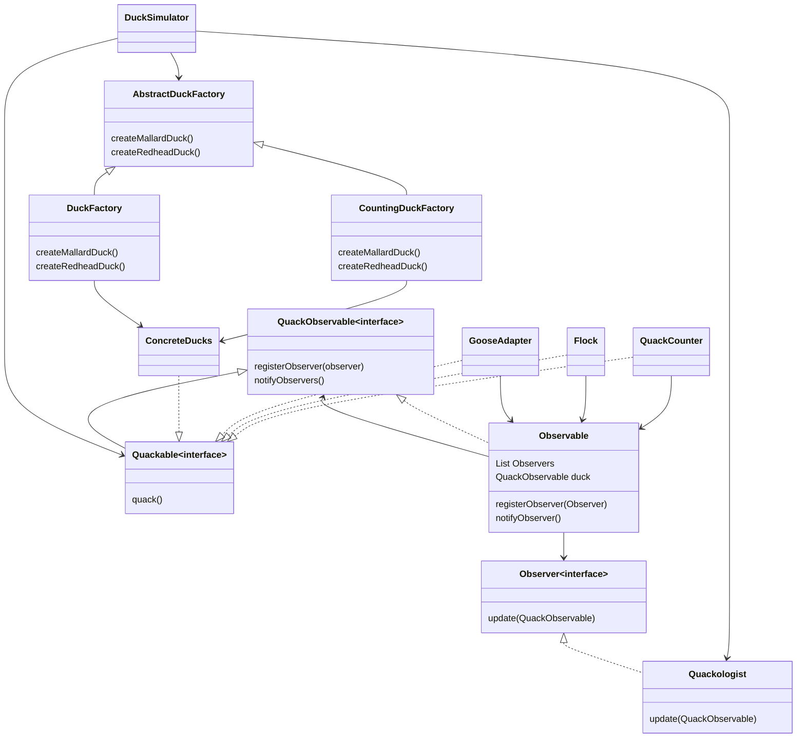
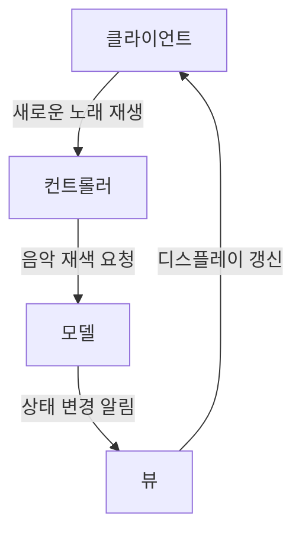
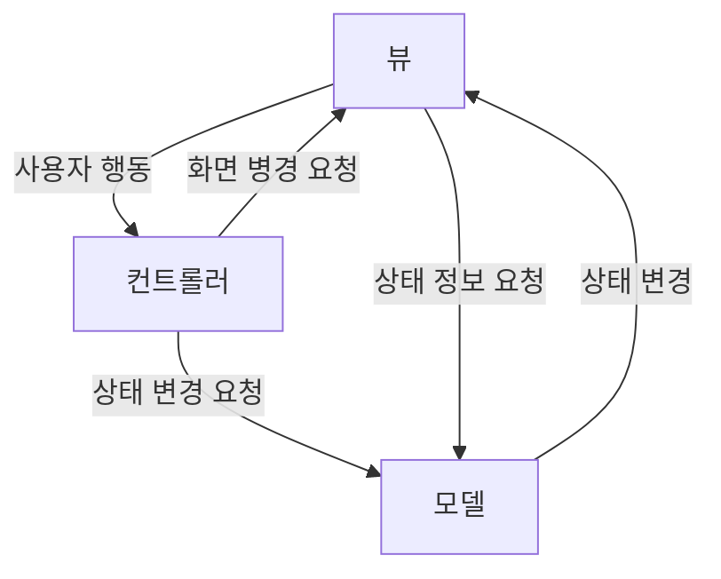

# 복합 패턴

- 같이 보기 : [2-3. 복합체](../디자인%20패턴에%20뛰어들기/2.%20구조%20패턴/2-3.%20복합체.md)

## 패턴 섞어 쓰기
- 패턴 섞어 쓰기 : 패턴을 잘 활용하는 방법 중 하나, 실전에서 많이 마주칠 수 있음
- 단순히 몇 가지 패턴을 사용하는 것 만으로 복합 패턴이라 부를 수 없음

## 오리 시뮬레이션 게임에 다양한 패턴 적용하기

### 1. Quackable 인터페이스 만들기

- Duck 객체에 Quackable 인터페이스 구현하여 오리의 종류와 상관없이 하나의 인터페스로 소리를 낼 수 있음

```java
public interface Quackable {
	public void quack();
}
```

### 2. Quackable을 구현해 오리 클래스 만들기

- 각 오리를 구현하여 서로 다른 울음소리가 나도록 함

```java
public class MallardDuck implements Quackable {
	public void quack() {
		System.out.println("꽥꽥");
	}
}

public class RubberDuck implements Quackable {
	public void quack() {
		System.out.println("삑삑");
	}
}
```

### 3. 시뮬레이터 만들기

```java
public class DuckSimulator {
	public static void main(String[] args) {
		DuckSimulator simulator = new DuckSimulator();
		simulator.simulate();
	}

	void simulate() {
		Quackable mallardDuck = new MallardDuck();
		// 다른 오리들 추가

		simulate(mallardDuck):
		// 다른 오리들 추가
	}
	void simulate(Quackable duck) {
		duck.quack();
	}
}
```

### 4. 시뮬레이터에 거위도 추가하기

```java
public void Goose {
	public void honk() {
		System.out.println("끽끽")
	}
}
```

### 5. 거위용 어댑터

- 시뮬레이터는 `Quackable` 인터페이스를 원하지만, 거위는 `honk()` 메서드를 사용
- 오리 자리에 거위를 사용할 수 있도록 [Chapter07. 어댑터 패턴](Chapter07.%20어댑터%20패턴.md) 생성

```java
public class GooseAdapter implements Quackable {
	Goose goose;

	public GooseAdapter(Goose goose) {
		this.goose = goose;
	}
	public void quack() {
		goose.honk();
	}
}
```

### 6. 시뮬레이터에 거위 추가

```java
public class DuckSimulator {
	public static void main(String[] args) {
		DuckSimulator simulator = new DuckSimulator();
		simulator.simulate();
	}

	void simulate() {
		Quackable mallardDuck = new MallardDuck();
		// 다른 오리들 추가
		Quackable gooseDuck = new GooseAdapter(new Goose());
		// 거위 추가 : 어댑터 사용

		simulate(mallardDuck):
		// 다른 오리들 추가
		simulate(gooseDuck);
		// 거위 추가
	}
	void simulate(Quackable duck) {
		duck.quack();
	}
}
```

### 7. 시뮬레이션 실행

### 8. 꽤꽥 소리를 낸 횟수를 세 주는 기능

- [Chapter03. 데코레이터 패턴](Chapter03.%20데코레이터%20패턴.md)를 만들어서 객체들을 그 데코레이터 객체로 감싸면 됨
- 그렇게 하면 Duck 코드는 건드리지 않아도 됨

```java
public class QuackCounter implements Quackable {
	Quackable duck;
	static int numberOfQuacks;

	// 생성자에서 감싸고 있는 Quackable 레퍼런스 가져옴
	public QuackCounter (Quackable duck) {
		this.duck = duck;
	}
	// quack 메서드를 위임받아서 실행
	public void quack() {
		duck.quack();
		numberOfQuack++;
	}
	public static int getQuacks() {
		return numberOfQuacks;
	}
}
```

### 9. 시뮬레티어를 고쳐서 오리를 데코레이터로 감싸줌

```java
public class DuckSimulator {
	public static void main(String[] args) {
		DuckSimulator simulator = new DuckSimulator();
		simulator.simulate();
	}

	void simulate() {
		Quackable mallardDuck = new QuackCounter(new MallardDuck());
		// 오리를 QuackCounter 데코레이터로 감쌈
		// 다른 오리들 추가
		Quackable gooseDuck = new GooseAdapter(new Goose());
		// 거위 추가 : 어댑터 사용

		simulate(mallardDuck):
		// 다른 오리들 추가
		simulate(gooseDuck);
		// 거위 추가

		System.out.println(QuackCounter.getQuackes());
		// 오리가 운 횟수 출력
	}
	void simulate(Quackable duck) {
		duck.quack();
	}
}
```

### 10. 오리를 생성하는 팩토리

- 데코레이터로 모든 오리를 감싸는 행동을 하는것은 비효율적이지만 필요한 과정
- 데코레이터로 모든 오리를 감싸기 위해 [Chapter04. 추상팩토리 패턴](Chapter04.%20추상팩토리%20패턴.md)사용

```java
public abstract class AbstractDuckFactory {
	public abstract Quackable createMallardDuck();
	// 다른 오리들 추가
}
```

- 데코레이터가 없는 오리 생성 팩토리

```java
public class DuckFactor extends AbstractDuckFactory {
	public Quackable createMallardDuck() {
		return new MallardDuck();
	}
	// 다른 오리들 추가
}
```

- 데코레이터로 감싼 오리 생성 팩토리

```java
public class DuckFactor extends AbstractDuckFactory {
	public Quackable createMallardDuck() {
		return new QuackCounter(new MallardDuck());
	}
	// 다른 오리들 추가
}
```

### 11.  팩토리를 사용하여 시뮬레이터 고치기

- 팩토리를 받아서 다형성을 갖추면서 객체를 생성하는 메소드를 만들어야 됨
- 추상 팩토리 패턴을 쓰면 팩토리의 종류에 따라 다양한 제품군을 만들 수있음

```java
public class DuckSimulator {
	public static void main(String[] args) {
		DuckSimulator simulator = new DuckSimulator();
		AbstractDuckFactory duckFactory = new CounterDuckFactory();
		// 팩토리 추가
		simulator.simulate();
	}

	void simulate(AbstractDuckFactory duckFactory) {
		Quackable mallardDuck = duckFactory.createMallardDuck();
		// 오리를 팩토리를 사용하여 데코레이터로 감쌈
		// 다른 오리들 추가
		Quackable gooseDuck = new GooseAdapter(new Goose());
		// 거위 추가 : 어댑터 사용

		simulate(mallardDuck):
		// 다른 오리들 추가
		simulate(gooseDuck);
		// 거위 추가

		System.out.println(QuackCounter.getQuackes());
		// 오리가 운 횟수 출력
	}
	void simulate(Quackable duck) {
		duck.quack();
	}
}
```

- 하지만 여전히 각각의 오리들을 따로따로 생성 및 관리해야 함

### 12. 오리 무리 만들기

- 객체들로 구성된 컬렉션을 개별 객체와 같은 방식으로 다룰 수 있게 해 주는 [Chapter09. 컴포지트 패턴](Chapter09.%20반복자,%20컴포지트%20패턴.md)

```java
public class Flock implements Quackable {
	List<Quackable> quackers = new ArrayList<Quackable>();

	public void add(Quackable quacker) {
		quackers.add(quacker);
	}
	public void quack() {
		Iterator<Quackable> iterator = quackers.iterator();
		while (iterator.hasNext()) {
			Quackable quacker = iterator.next();
			quacker.quack();
		}
	}
}
```

- `quack()` 메서드에서 `Interator`를 사용하여는 [Chapter09. 반복자 패턴](Chapter09.%20반복자,%20컴포지트%20패턴.md)

### 13. 시뮬레티어에 복합 객체 적용하기

```java
public class DuckSimulator {
	// main 메서드

	void simulate(AbstractDuckFactory duckFactory) {
		Quackable redheadDuck = duckFactory.createRedheadDuck();
		// 오리 생성
		Flock flockOfDucks = new Flock();
		flockOfDucks.add(mallardDuck);
		// flock에 오리 추가
		
		Flack flockOfMallards = new Flock();
		Quackable mallardOne = duckFactory.createMallardDuck();
		// Mallard Duck만 생성
		flockOfMallard.add(mallardOne);
		// Mallard Duck만 추가

		flockOfDucks.add(flockOfMallards);

		simulate(flockOfDucks);
		simulate(flockOfMallards);
		System.out.println(QuackCounter.getQuacks())
	}
	void simulate(Quackable duck) {
		duck.quack();
	}
}
```

### 14. 개별 오리 행동 관찰

- [Chapter02. 옵저버 패턴](Chapter02.%20옵저버%20패턴.md)를 사용하여 개별 오리 행동을 관찰할 수 있음
- 관찰 대상이 되는게 Observable이 되고, 옵저버를 등록하는 메소드, 옵저버에게 연락을 돌리는 메소드가 있어야 함
	- 옵저버를 제거하는 코드도 있어야 함 (이 책의 예시에는 제외)

```java
public interface QuackObservable {
	public void registerObserver(Observer observer);
	public void notifyObserver();
}
```

- Quackable에서 이 인터페이스를 구현

```java
public interface Quackable extends QuackObservable {
	public void quack();
}
```

### 15. Quackable을 구현하는 모든 구상 클래스에서 QuackObservable에 있는 메소드를 구현

- 모든 클래스에서 일일이 등록하고 구현할수도 있지만, 다른 방법을 사용
- 등록 및 연락용 코드를 Observable 클래스에 캡슐화하고, 구성으로 QuackObservable에 포함
	- 실제로는 한 군데에만 작성을 하지만, 보조 클래스에 전부 위임하도록 할 수 있음

```java
public class Observable implements QuackObservable {
	List<Observer> observers = new ArrayList<Observer>();
	QuackObserveable duck;

	public Observable(QuackObservable duck) {
		this.duck = duck;
	}
	public void registerObserver(Observer observer) {
		observers.add(observer);
	}
	public void notifyObservers() {
		Iterator iterator = observers.iterator();
		while (iterator.hasNext) {
			Observer observer = iterator.next();
			observer.update(duck);
		}
	}
}
```

### 16. Observer 보조 객체와 Quackable 클래스 결합

- Quackable 클래스에 Observable 레퍼런스 추가하고 메소드 실행을 넘겨주면 됨

```java
public class MallardDuck implements Quackable {
	Observable observable;

	public MallardDuck() {
		observable new Observable(this);
	}
	public void quack() {
		System.out.println("꽥꽥");
		// quack 메서드가 실행되면 옵저버에게 알림
		norifyObservers();
	}
	// QuackObservale에서 정의한 메서드로 별다른 작업 없이 보조 객체에 넘김
	public void registerObserver(Observer observer) {
		observerbale.registerObserver(observer);
	}
	public void notifyObservers() {
		observable.notifyObservers();
	}
}
```

### 17. 옵저버 만들기

```java
public interface Observer {
	public void update(QuackObservable duck);
}

public class Quackologist implements Observer {
	public void update(QuackObservable duck) {
		System.out.println("꽥꽥학자: " + duck + " 가 방금 소리냈다.");
	}
}
```

### 18. 오리를 관찰하는 코드를 추가한 시뮬레이터

```java
public class DuckSimulator {
	// main 메서드

	void simulated(AbstractDuckFactory duckFactory) {
		// 오리 팩토리와 오리 생성
		// 오리 무리 생성

		Quackologist quackologist = new Quackologist();
		flockOfDucks.registerObserver(quackologist);

		simulate(flockOfDucks);
		System.out.println(QuackCounter.getQuacks())
	}

	void simulate(Quackable duck) {
		duck.quack();
	}
}
```

## 바뀐 내용 되돌아보기

- 처음에는 수많은 Quackable들이 있음
- 거위
	- 거위가 나타났을 때 **어댑터**를 사용하여 `honk()` 메서드 호출을 하게 해줌
- 꽥꽥 소리가 난 횟수 세기
	- **데코레이터**를 추가, `quack()` 메서드가 호출된 횟수 파악
- 데코레이터로 장식되지 않은 객체 방지
	- **추상 팩토리**를 사용하여 모든 오리를 데코레이터로 장식될수 있도록 함
- 모든 오리 및 거위 객체 관리
	- **컴포지트**를 사용해 오리 무리 단위로 관리
	- 같은 행동을 반복하기 때문에 **반복자** 활용
- 꽥꽥 소리가 났을 때 연락 받기를 원함
	- **옵저버**를 사용하여 등록

## 오리 시뮬레이션 게임 클래스 다이어그램



## 복합 패턴의 왕 : MVC

- [mvc song](https://www.youtube.com/watch?v=YYvOGPMLVDo)
- MVC는 핵심은 "디자인 패턴"

### MVC 알아보기

- iTunes와 같은 음악 소프트웨어에서 새로운 곡을 선택, 재생 등을 조작



### MVC 조금 더 알아보기



- 사용자는 뷰에만 접촉 가능 : 뷰는 사용자의 요청에 따라 컨트롤러에게 알려주어 행동함
- 컨트롤러가 모델에 상태 변경 요청
- 컨트롤러가 뷰를 변경 요청할 수 있음
- 상태 변경되면 모델이 뷰에 알림
- 뷰가 모엘에 상태 요청

### MVC에 사용되는 패턴 알아보기

- 모델 옵저버 패턴
- 컨트롤러 : 전략 패턴
- 뷰 : 컴포지트 패턴

#### 옵저버 패턴
- 모델은 뷰나 컨트롤러에 의존하지 않음, 대신 상태 변경이 감지되면 그에 해당하는 작업을 함
- 옵저버 패턴을 사용하여 한 모델에서 서로 다른 뷰를 사용할수도, 여러 개의 뷰를 동시에 사용하는 것도 가능

#### 전략 패턴
- 뷰는 겉모습만 신경을 쓰고, 인터페이스 결정은 컨트롤러에게 맡김
- 전략 패턴을 사용하여 뷰를 모델로부터 문리하는데 도움을 받음

#### 컴포지트 패턴
- 디스플레이는 여러 단계로 구성됨, 윈도우, 패널, 버튼, 텍스트 등등
- 각 디스플레이 상목을 컴포지트 패턴을 활용하여 더 앞이나 뒤에 배치될 수 있도록 함

### BPM(beat per minute) 제어 도구
