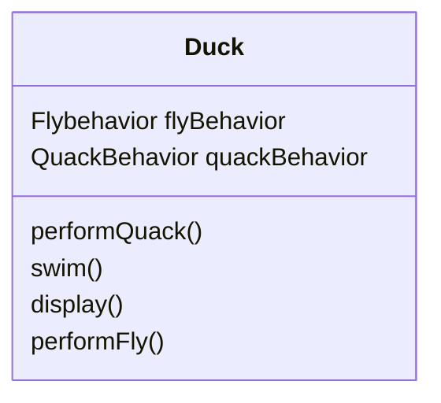

# 전략 패턴

## 오리 시뮬레이션 게임 (SimUduck)

- 슈퍼클래스를 작성하고 이를 확장하여 다양한 오리 생성

[](https://user-images.githubusercontent.com/37922134/215445706-b521079e-b6b4-4ae8-8ad0-18dc5765a519.png)

- 모든 오리가 꽥(quack) 소리를 내고 수영(swim)을 할 수 있음

- 오리마다 모양이 다르기 때문에 display() 는 오버라이드


### fly() 기능 추가

[](https://user-images.githubusercontent.com/37922134/215445701-d32d30fc-56fe-4f75-858d-b47786930177.png)

- 날지 말아야 하는 RubberDuck에도 fly() 기능이 추가 되어 버림

- RubberDuck에 fly()를 오버라이드하여 처리
  - 날지 말아야할 오리가 추가될 때마다 재정의 해줘야 함


### 🤔 인터페이스 사용?

- 계속 오버라이드 해야하는 메서드 `fly()` `quack()`만 빼서 인터페이스 생성


- 일부 문제점은 해결할 수 있지만 코드를 재사용하지 않으므로 코드 관리에 문제가 생김

- 인터페이스를 사용하는 클래스에서 해당 코드를 전부 구현해줘야 함


## 전략 패턴 적용하기

### ✅ 디자인 원칙 1

> - 애플리케이션에서 달라지는 부분을 찾아내고, 달라지지 않는 부분과 분리한다.
>   - 달라지는 부분은 **캡슐화**한다.
>   - 다른 코드에 영향을 미치지 않고 고치거나 확장할 수 있어서 시스템의 유연성이 향상된다.


### 바뀌는 부분과 그렇지 않은 부분 분리하기

- fly() 와 quack()은 Duck 클래스의 오리 종류에 따라 달라짐

- 2개의 메소드 모두 Duck 클래스에서 끄집어 내서 **각 행동을 나타낼 클래스 집합을 새로 만들어야 함**


### ✅ 디자인 원칙 2

> - 구현보다는 인터페이스에 맞춰서 프로그래밍 한다
>
> - 상위 형식에 맞춰서 프로그래밍 하는 것
>
> - 객체를 변수에 대입할 때 상위 형식을 구체적으로 구현한 형식이라면 어떤 객체든 넣을 수 있기 때문


### 오리의 행동 구현 하기

- 각 행동을 인터페이스로 표현하고, 인터페이스를 사용해서 행동을 구현

  - 특정 행동만 목적으로 하는 클래스의 집합을 만드는 것

  - Duck 클래스에서 구체적으로 구현하거나 서브클래스 자체에서 별도로 구현하는 방법과는 상반됨


- 다른 형식의 객체에서도 나는 행동과 꽥꽥 거리는 행동을 재사용 할 수 있음

- 기존 행동 클래스를 수정하거나 Duck 클래스를 건드리지 않고 새로운 행동을 추가할 수 있음


## 분리한 행동 통합하기



- 나는 행동과 꽥꽥 거리는 행동을 Duck 클래스에서 정의한 메소드를 써서 구현하지 않고 **다른 클래스에 위임**


### performQuack()

``` java
public abstract class Duck{
  // 모든 Duck에는 QuackBehavior 인터페이스 구현 레퍼런스가 있음
  QuackBehavior quackBehavior;
  
  // 꽥꽥 거리는 행동을 직접 처리하는 대신, quackBehavior로 참조되는 객체에 그 행동을 위임
  public void performQuack() {
		quackBehavior.quack();
	}
}
```

- 꽥꽥 거리고 싶을 땐 객체의 종류에 신경쓸 필요 없이 quack()을 실행하기만 하면 됨


### MallardDuck()

- Duck을 상속받은 MallardDuck 에서 flyBehavior과 quackBehavior 인스턴스 변수 설정 하기

``` java
public class MallardDuck extends Duck {
  
  // Duck 클래스에서 인스턴스 변수를 상속 받고, 생성자에서 해당 변수를 설정
  public MallardDuck(){
    quackBehavior = new Quack();
    flyBehavior = new FlyWithWings();
  }
  
  public void display(){
    System.out.println("저는 물오리입니다.");
  }
  
}
```


> 🚨 디자인 원칙에 따르면 인터페이스에 맞춰 작성하라고 했지만, Quack()이라는 구현되어 있는 구상 클래스의 인스턴스를 만듦 (차후에 해당 문제를 해결할 패턴이 나온다고 함)


## 코드 살펴보기

- Duck 클래스

``` java
public abstract class Duck {
  // 행동 인터페이스 형식의 레퍼런스 변수 2개 선언
  // 같은 패키지에 속하는 모든 서브 클래스에서 이 변수를 상속받음
	FlyBehavior flyBehavior;
	QuackBehavior quackBehavior;

	public Duck() {}

	abstract void display();

  
  // 행동 클래스에 위임
	public void performFly() {
		flyBehavior.fly();
	}

	public void performQuack() {
		quackBehavior.quack();
	}

	public void swim() {
		System.out.println("모든 오리는 물에 뜹니다. 가짜 오리도 뜨죠.");
	}
}

```


- FlyBehavior 인터페이스와 행동 구현 클래스

``` java
public interface FlyBehavior {
	public void fly();
}

public class FlyWithWings implements FlyBehavior {
	public void fly() {
		System.out.println("날고 있어요!!");
	}
}

public class FlyNoWay implements FlyBehavior {
	public void fly() {
		System.out.println("저는 못 날아요");
	}
}
```


- QuackBehavior 인터페이스와 행동 구현 클래스

``` java
public interface QuackBehavior {
	public void quack();
}

public class Quack implements QuackBehavior {
	public void quack() {
		System.out.println("꽥");
	}
}

public class MuteQuack implements QuackBehavior {
	public void quack() {
		System.out.println("<< 조용 >>");
	}
}

public class Squeak implements QuackBehavior {
	public void quack() {
		System.out.println("삑");
	}
}

```


- 테스트 클래스

``` java
public class MiniDuckSimulator {
 
	public static void main(String[] args) {
 
		Duck mallard = new MallardDuck();
		mallard.performQuack();
		mallard.perforFly();
	}
}
```

> 꽥
>
> 날고 있어요!! 


## 동적으로 행동 지정하기

- Duck 클래스에 setter 메소드를 추가하여 실행 중에 변경 가능

``` java
	public void setFlyBehavior(FlyBehavior fb) {
		flyBehavior = fb;
	}

	public void setQuackBehavior(QuackBehavior qb) {
		quackBehavior = qb;
	}

```


``` java
public class MiniDuckSimulator {
 
	public static void main(String[] args) {
 
		Duck mallard = new MallardDuck();
    mallard.perforFly();
    mallard.setFlyBehavior(new FlyNoWay);
		mallard.perforFly();
	}
}
```

> 날고 있어요!!
>
> 저는 못 날아요


## 두 클래스를 합치는 방법

"A에는 B가 있다"

- 각 오리에는 FlyBehavior와 QuackBehavior가 있으며, 각각 나는 행동과 꽥꽥거리는 행동을 위임받음
- 이런 식으로 두 클래스를 합치는 것을 **'구성(composition) 을 이용한다'** 고 함
  - 행동을 상속받는 대신, 올바른 행동 객체로 구성되어 행동을 부여받음 (유연성 ⬆)


### ✅ 디자인 원칙 3

> 상속보다는 구성을 활용한다.


## 전략 패턴(Strategy Pattern)

- 알고리즘군을 정의하고 캡슐화해서 각각의 알고리즘군을 수정해서 쓸 수 있게 해줌
- 클라이언트로부터 알고리즘을 분리해서 독립적으로 변경할 수 있음