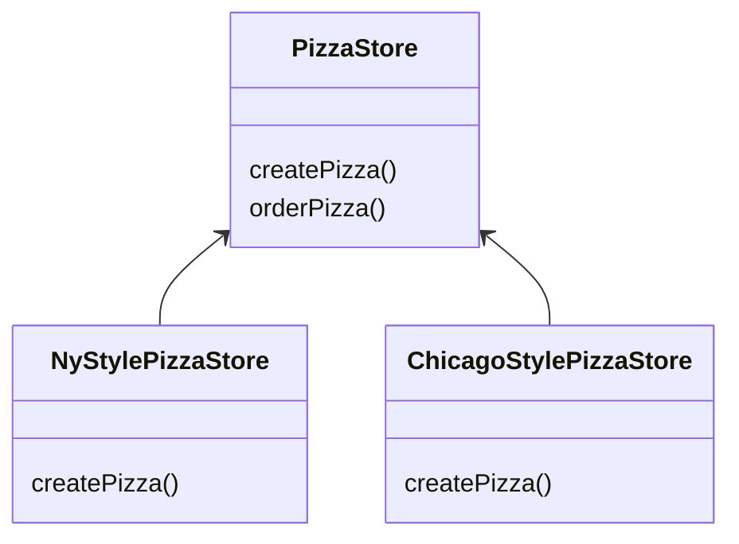

# 팩토리 메서드 패턴

## 짚고 넘어가기

>  [디자인 원칙 2 ](https://github.com/CS-yorisa/CS-COOK-BOOK/blob/main/books/헤드퍼스트%20디자인패턴/Chapter01.전략%20패턴.md#-디자인-원칙-2)에서 `특정 구현을 바탕으로 프로그래밍 하지 않아야 한다` 고 했으나 `new` 를 쓸 때마다 특정 구현을 사용하게 되는 것이 아닌가?

- new 연산자가 눈에 띈다면 '구상' 이라는 용어를 떠올리면 됨

  - new 를 사용하면 구상 클래스의 인스턴스가 만들어지므로 특정 구현을 사용하는 것과 다름 없음

    ``` java
    Duck duck;
    // 일련의 구상 클래스가 있다면 다음과 같은 코드를 만들어야 함
    if (picnic) {
      duck = new MallardDuck();
    } else if (hunting) {
      duck = new DecoyDuck();
    } else if (inBatchTub) {
      duck = new RubberDuck();
    }
    ```

  - 관리와 갱신이 어려워지고 오류가 생길 가능성이 큼

- 'new' 의 문제

  - 인터페이스를 바탕으로 만들어진 코드는 '다형성' 을 띔

  - 구상 클래스를 사용하면 '변경에 닫혀 있는' 코드가 됨

  - 확장 시에는 다시 '열려있게' 구성해야 함 (OCP)

    => 바뀌는 부분을 찾아내서 바뀌지 않는 부분과 분리


## 최첨단 피자 코드 만들기

- 피자 가게를 위해 미리 만든 코드

``` java
Pizza orderPizza() {
  Pizza pizza = new Pizza();
  
  pizza.prepare();
  pizza.bake();
  pizza.cut();
  pizza.box();
  return pizza;
}
```


- 주문에 맞는 피자를 만드는 코드 추가

``` java
Pizza orderPizza(String type) {
  Pizza pizza = new Pizza();
  
  // 피자 종류를 바탕으로 올바른 구상 클래스의 인스턴스를 만들고
  // pizza 인스턴스 변수에 그 인스턴스를 대입
  // 모든 피자 클래스는 Pizza 인터페이스를 구현함
  
  if (type.equals("cheese")) {
    pizza = new CheesePizza();
  } else if (type.equals("greek")) {
    pizza = new GreekPizza();
  } else if (type.equals("pepperoni")) {
    pizza = new PepperoniPizza();
  }
  
  pizza.prepare();
  pizza.bake();
  pizza.cut();
  pizza.box();
  return pizza;
}
```


### 메뉴가 추가 혹은 삭제 된다면?

``` java
Pizza orderPizza(String type) {
  Pizza pizza = new Pizza();
  
  // 계속 바뀌는 부분 (인스턴스를 만드는 구성 클래스를 선택하는 부분)
  
  if (type.equals("cheese")) {
    pizza = new CheesePizza();
  // } else if (type.equals("greek")) {
  //  pizza = new GreekPizza();
  } else if (type.equals("pepperoni")) {
    pizza = new PepperoniPizza();
  } else if (type.equals("clam"){
    pizza = new ClamPizza();
  } else if (type.equals("veggie") {
    pizza = new VeggiePizza();
  }
  
  // 바뀌지 않는 부분
  pizza.prepare();
  pizza.bake();
  pizza.cut();
  pizza.box();
  return pizza;
}
```


### 객체 생성 부분 캡슐화

- 객체 생성을 처리하는 클래스를 <u>**`팩토리(Factory)`**</u> 라고 부름
- `SimpleFactory`를 만들고 나면 `orderPizza()` 메소드는 새로 만든 객체의 클라이언트가 됨


### 객체 생성 팩토리 만들기

``` java
public class SimplePizzaFactory {
  
  // 클라이언트가 새로운 객체 인스턴스를 만들때 호출하는 메소드
  public Pizza createPizza(String type){
    
    pizza pizza = null;
   
    // orderPizza()에서 뽑아낸 코드
    if (type.equals("cheese")) {
    	pizza = new CheesePizza();
    } else if (type.equals("pepperoni")) {
      pizza = new PepperoniPizza();
    } else if (type.equals("clam"){
      pizza = new ClamPizza();
    } else if (type.equals("veggie") {
      pizza = new VeggiePizza();
    }
               
    return pizza;
  }
}
```

- 피자 객체 생성 작업을 팩토리 클래스로 캡슐화 해두면 구현 변경 시, 팩토리 클래스만 고치면 됨
- 팩토리를 정적 메소드로 정의하는 정적 팩토리(static factory)
  - 객체 생성 메소드를 실행하려고 객체 인스턴스를 만들지 않아도 됨
  - 서브클래스를 만들어서 객체 생성 메소드의 행동을 변경할 수 없음


### 클라이언트 코드

``` java
public class PizzaStore {
  SimplePizzaFactory factory;
  
  // PizzaStore 의 생성자에 팩토리 객체가 전달
  public PizzaStore(SimplePizzaFactory factory){
    this.factory = factory;
  }
  
  public Pizza orderPizza(String type){
    pizza pizza;
    
    // new 연산자 대신 팩토리의 create 메소드를 사용
    // 더 이상 구상 클래스의 인스턴스를 만들 필요 없음
    pizza = factory.createPizza(type);
    
    pizza.prepare();
    pizza.bake();
    pizza.cut();
    pizza.box();
    
    return pizza;
  }
}
```


## '간단한 팩토리'의 정의

- 디자인 패턴이라기 보다는 프로그래밍에서 자주 쓰이는 관용구


### 다양한 팩토리 만들기

- 만약, 여러 지역에 프랜차이즈가 생긴다면?


- SimplePizzaFactory 대신 서로 다른 팩토리(NYPizzaFactory, ChicacoPizzaFactory, CaliforniaPizzaFactory)를 만들고 PizzaStore 에서 적당한 팩토리를 사용하도록 함

``` java
NYPizzaFactory nyFactory = new NYPizzaFactory();
PizzaStore nyStore = new PizzaStore(nyFactory);
nyStore.orderPizza("Veggie");

ChicagoPizzaFactory chicagoFactory = new ChicagoPizzaFactory();
PizzaStore chicagoStore = new PizzaStore(chicagoFactory);
chicagoStore.orderPizza("Veggie");
```

- 팩토리를 사용하나 가게에서 피자를 만드는 과정에서 빠지거나 달라지는 부분이 생길 수 있음
- 피자 가게와 피자를 만드는 과정을 하나로 묶는 과정이 필요


## 팩토리 메소드 선언하기

- createPizza를 추상 메소드로 선언하고, **서브클래스** 만들기



``` java
public abstract class PizzaStore {
  public Pizza orderPizza(String type) {
    Pizza pizza;
    
    // 팩토리 객체가 아닌 PizzaStore 내의 createPizza 호출
    pizza = createPizza(type);
    
    pizza.prepare();
    pizza.bake();
    pizza.cut();
    pizza.box();
    
    return pizza;
  }
  
  
  // 팩토리 메소드가 PizzaStore의 추상메소드가 됨
  abstract Pizza createPizza(string type);
}
```


- PizzaStore의 서브클래스 에서 createPizza() 메소드를 구현
  - 각 서브클래스가 orderPizza()를 오버라이드 할 수 없게 하려면 `final` 로 선언하면 됨
- **객체의 생성을 서브클래스에 캡슐화**하여 슈퍼클래스의 클라이언트 코드와 서브클래스의 객체 생성 코드를 분리


  - 추상 메소드로 선언하여 서브클래스가 객체의 생성을 책임지도록함
  - 팩토리 메소드는 특정 객체를 리턴하며 슈퍼클래스가 정의한 메소드 내에서 쓰임
  - 클라이언트에서 실제로 생성되는 구상 객체가 무엇인지 알 수 없게 만드는 역할도 함

  

- 피자 종류는 '어떤 서브클래스를 선택했느냐'에 따라 결정
``` java
// Pizza 객체를 리턴하며 Pizza의 서브클래스 중 어느 구상 클래스 객체의
// 인스턴스를 리턴할지는 서브클래스가 결정
public class NYPizzaStore extends PizzaStore {
  
  // 추상 메소드로 선언되었으므로 구상 클래스에서 반드시 구현
  Pizza createPizza(String item){
    if (type.equals("cheese")) {
    	pizza = new NYStyleCheesePizza();
    } else if (type.equals("pepperoni")) {
      pizza = new NYStylePepperoniPizza();
    } else if (type.equals("clam"){
      pizza = new NYStyleClamPizza();
    } else if (type.equals("veggie") {
      pizza = new NYStyleVeggiePizza();
    }
  }
}
```

- Pizza 클래스도 똑같이 Pizza 추상 클래스를 만든 뒤, 이를 확장하여 구상 클래스를 만들 수 있음


## 팩토리 메소드 패턴

- 객체를 생성할 때 필요한 인터페이스를 만듦
- 어떤 클래스의 인스턴스를 만들지는 서브클래스에서 결정
- 팩토리 메소드 패턴을 사용하면 클래스 인스턴스를 만드는 일을 서브클래스에 맡기게 됨
  - 사용하는 서브클래스에 따라 생산되는 객체 인스턴스가 결정됨