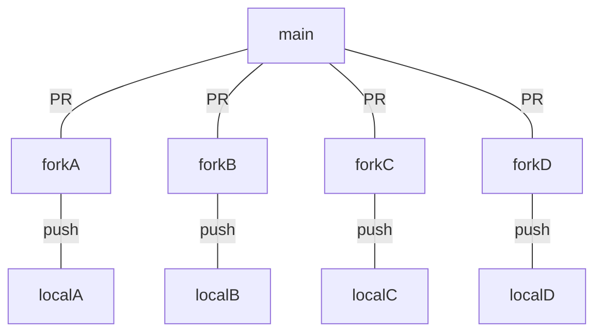

# Git branch 전략
- git을 활용하여 협업할 때, 어떻게 브랜치를 나누고 관리할지에 대하여 전략을 정의하고 활용하기 위한 방법

# gitf low
- 5가지 브랜치 활용
	- master : 기준이 되는 브랜지, 배포
	- develop : 개발 브랜치, 작업한 기능들이 병합됨
	- feature : 단위 기능 개발하는 브랜치로, develop로 병합
	- release : 배포를 위한 브랜치로 QA 실행
	- hotfix : master로 배포한 기능이 버그가 생겼을 때 긴급 수정
- 운영 전략
	- master 브랜치에서 develop브랜치를 분기
	- 개발자들은 develop브랜치에 자유롭게 커밋
	- 기능 구현의 경우 develop 브랜치에서 feature브랜치로 분기
	- 배포를 할 때 develop 브랜치에서 release 브랜치로 분기
	- 테스트가 완료되면 release브랜치를 master, develop로 변합
- feature 브랜치의 경우 보통 이슈 번호, 기능 이름 등을 활용
	- feature/#1, feature/login
- [git-flow](https://hbase.tistory.com/60)를 활용하여 브랜치 전략을 더 쉽게 사용할 수 있음
	- git-flow : git flow를 위한 git의 확장 

## 참조
- [협업을 위한 git flow 설정하기](https://overcome-the-limits.tistory.com/7)
- [git-flow cheatsheet](https://danielkummer.github.io/git-flow-cheatsheet/index.ko_KR.html)

# GitHub Flow
- git flow는 비교적 많은 브랜치와 복잡한 전략을 가지고 있어, 더 간략하게 운영하는 전략
- 수시로 배포가 일어나고, CI/CD가 자동화되어 있는 프로젝트에 유용
- 전략
	- master브랜치는 언제든지 배포 가능 상태 유지
	- master에 병합되면 즉시 배포
	- 브랜치 생성시 이름을 명확히 작성
	- origin으로 수시로 push
	- 병합 이후 브랜치는 삭제

## 참조
- [브랜치 전략 - GitHub flow](https://brownbears.tistory.com/603)

# GitLab Flow
- GitHub flow는 매우 단순화된 형태로 운영
	- 대신 master, feature, production브랜치로 구분
	- feature : 모든 기능 구현이 이루어지고, master로 병합
		- git flow의 develop역할
	- production : 기능에 대한 보장이 되면 병합 및 배포

# Fork & PR

- 규모있는 개발 또는 오픈소스 등에서 사용하는 전략

# 참조
- [git branch 전략, git flow, github flow, gitlab flow, fork & pr](https://velog.io/@kw2577/Git-branch-%EC%A0%84%EB%9E%B5)
- [git branch 전략에 대해서](https://tecoble.techcourse.co.kr/post/2021-07-15-git-branch/)
- 