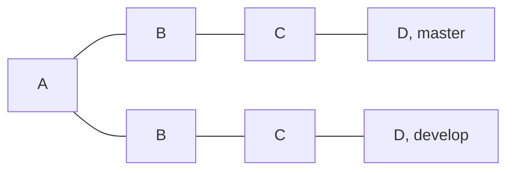
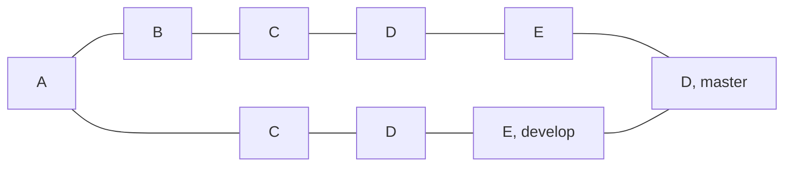
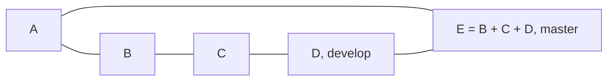

# Git Merge Type
- 브랜치가 병합되는 방식은 크게 merge, squash merge, rebase merge로 구분할 수 있음

## merge
- 일반적인 merge는 다시 fast-forward, recursive로 구분

### fast-forward

- develop브랜치에서 B, C, D 커밋을 실행한 후, master 브랜치에서 merge하는 경우
	- `Fast-forward`라고 나오며 병합이 되고, 분기된 시점 이후 작업 내용이 붙게됨

### revursive

- 분기된 이후 병합을 시도하는 브랜치에서 또다른 커밋을 가지고 있는 경우, merge commit이 발생하며 병합됨

# Squash merge

- 기존 작업 내용을 제거하고, 하나의 커밋 생성

# Rebase merge

- 새로운 커밋으로 재배치
	- fast-forward merge와 같은 형태로 진행됨
	- 하지만 커밋의 재배치로 인한 커밋 해시값이 다름

# 참조
- [세 가지 merge 방식](https://mangchhe.github.io/git/2021/09/04/GitMerge/)
- [GitHub merge 이해하기](https://datalibrary.tistory.com/194)
