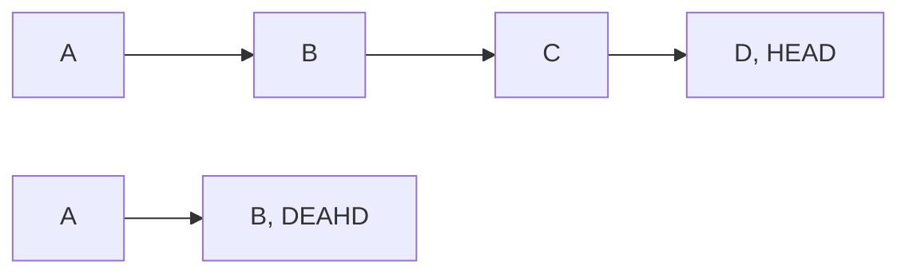
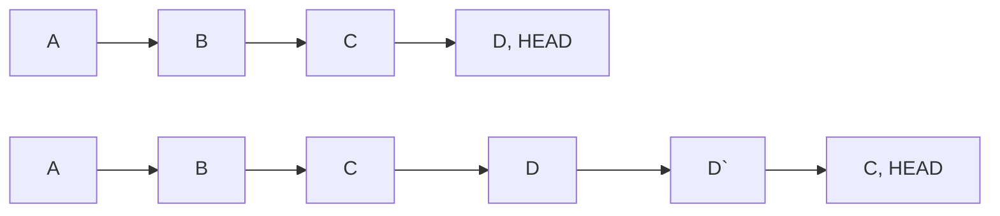

# Git 명령어

## git add
- 파일을 index에 추가
	- index는 working tree의 snapshot을 가짐
	- snapshot은 각 컨텐츠의 다음 commit

- pathspec : 추가하고자 하는 파일
	- 특정 확장자, 이름을 가진 파일 등만 추가할 수 있음
		- `git add doc/\*.txt`
		- `git add git-*.sh`
- -A, --all, --no-ignore-removal
	- 지금 작업 디렉터리와 상관없이 모든 변경 내용을 스테이지
	- `git add .`을 활용하면, 현재 디렉터리 이하 모든 내용만 반영
	- `git add -A`를 활용하면 프로젝트 최상위 디렉터리에서 `git add .`을 하는 것과 동일한 효과
- -i, --interactive
	- interactive 모드로 작업
- -p, --patch
	- 각 덩어리별로 비교하며 스테이지 할것인지 아닌지 결정할 수 있음

## git status
- 작업 경로의 상태
- -s --short
	- 출력을 짧게
- --long
	- 출력을 길게, default

## git diff
- 파일의 변경상태 확인
	- status는 파일이 변경되었는지, 생성되었는지 정도만 확인할 수 있는 반면, diff는 어떤 변경 사항이 있는지 확인할 수 있음
- --staged, --cached
	- staging area에 있는 내용과 변경 사항 확인

## commit
- 변경 사항에 대한 기록
- -a, --all
	- 수정, 삭제된 파일을 자동적으로 스테이지하고 commit 실행
	- 새로운 파일은 영향받지 않음
- -C {commit}, --reuse-message={commit}
	- 이미 사용한 커밋 메시지를 사용
- --reset-author
	- -C, -c, --amend 옵션을 사용할 때, 또흔 cheery-pick 충돌 이후 작성자를 바꿀때 사용
- -F {file}, --file={file}
	- 커밋 메시지를 해당 파일로 지정
- -m {msg}, --message={msg}
	- 커밋 메시지를 함께 작성하여 진행
- --amend
	- 마지막 커밋에 추가할 사항, 변경할 사항이 있는 경우 덮어씌우는 옵션

## notes
- git 객체는 persistent data structure 노드이므로 수정할 수 없음
	- commit --amend같은 경우도 커밋 객체를 새로 만드는 것
- 커밋을 변경하지 않고 정보를 추가할 수 있음
	- git notes라는 커밋 객체를 생성, 기존 커밋의 노트로 확인할 수 있음

## restore
- git의 파일조작만을 위한 기능을 지원
- 파일 이름을 통하여 파일을 head commit 으로 돌릴 수 있음
- --source {commit} {file name}
	- 특정 커밋, 특정 파일로 복구
- --staged
	- add를 통하여 스테이지한 파일을 unsatging

## reset

- 특정 시기로 되돌아가고, 해당 사건들은 사라짐
	- 과거 이력이 남지 않음
- --soft {commit}
	- commit된 파일을 staging area로 (commit 직전으로)
- --mixed {commit}
	- commit된 파일을 working directory로, default (add 직전으로)
- --hard {commit}
	- commit된 파일 중 tracked 파일들을 working directory에서 삭제
	- untracked 파일은 그대로 남음
- HEAD~{숫자}, HEAD^
	- HEAD~{숫자}를 통해 원하는 만큼의 커밋 취소
	- HEAD^를 통해 최근 커밋 취소

## revert

- 특정 시기로 되돌아가지만, revert한 이력이 남음
	- 시점은 현재로 남지만, 과거의 커밋들을 없던 일로 만듬
- 돌아가고자 하는 커밋 해쉬값으로 사용할 수 있음
- --no-commit {commit}
	- revert 결과를 유지, 커밋하지 않을 경우

### reset vs revert
- 개인 프로젝트 또는 로컬에서 작업한 내용에 대하여 되돌아 가고자 한다면 reset을 활용하여 커밋을 완전히 제거할 수 있음
- 협업 프로젝트에서 커밋 이력이 reset으로 삭제되면 충돌 발생 가능성이 있고, 작업 이력을 남겨두는 의미에서 revert를 사용하는 것이 좋음 

## rm
- 파일 삭제
	- 터미널에서 rm 명령어로 삭제하는 경우, 삭제되지만, 스테이지 되지 않은 상태로 표현
	- `git rm`을 사용하면 `rm` 이후 `git add`를 하는것과 같은 효과
- -- cached
	- 저장소에서는 파일을 삭제하지만, 실제로 파일을 삭제하지 않을 때

## mv
- rm과 유사하게 파일이름을 변경하고자 하는겨우 변경 및 스테이지까지 실행
	- mv로 파일 복사, 기존 파일 삭제, 생성된 파일 스테이를 한번에 실행

## branch
- 프로젝트를 여러 갈래로 나누어 관리 할 수 있게 하는 기능
- {브랜치 이름}
	- 새로운 브랜치 생성
- -l, --list
	- 로컬의 브랜치 탐색
	- 패턴과 함께 검색할 수 있음
		- `git branch --list 'main-*'`
- -a, --all
	- 로컬과 리모트의 모든 브랜치에 대하여 탐색하고, 패턴 검색도 가능
- -r, --remotes
	- 리모트의 브랜치에 대해서만 검색, 패턴 검색도 가능
- -d, --delete
	- 브랜치 삭제
	- 브랜치가 완전히 머지되어 있어야 함
- -D
	- 강제 삭제
		- --delete --forece 와 같음

## checkout
- 브랜치 변경(switch) 및 변경사항 복원(restore) 진행
- git 2.23버전에서 switch, restore로 기능을 분리

## switch
- 브랜치를 변경하는 부분만 담당
- -c {new-branch}, --create {new-branch}
	- `git checkout -b {new-branch}`와 같은 역할
- --guess
	- 원격에 해당 브랜치가 있는 경우 새로 만들지 않고 원격 브랜치와 매칭
		- `git switch -c {branch} --track {remote}/{branch}`와 같은 역할
	- 원격 브랜치가 아니라 새로 생성하고자 하면 --no-guess

## merge
- 작업한 두개의 브랜치 병합
- --squash
	- 브랜치 병합할 때 커밋이력을 모두 제거하고 작업 내용만 병합
- --no-ff
	- fast-forward방식 병합일 때, 커밋 메시지 작성
- --abort
	- 병합 중 충돌발생했을 때, 머지 작업을 취소하고 되돌아가기

## log
- 커밋 이력 조회
- -n {숫자}
	- 최신 커밋 n개만 살펴봄
- --oneline
	- 커밋을 한줄로 요약
- --graph
	- 커밋과 브랜치 흐름을 그래프 형태로
- --decorate
	- 커밋 외 브랜치, 태그 등 표시 옵션
	- short, full, auto, no
- -p, --patch
	- 파일의 수정된 내용도 확인
- --pretty
	- 추가적 옵션 부여하여 다양한 형식으로 확인할 수 있음

## stash
- 마무리 되지 않은 작업을 임시 저장할 수 있는 명령어
- `git stash`, `git stash save`로 현재 작업 디렉터리를 저장
- list
	- stash 목록 확인
- apply
	- 기본적으로 가장 최근 stash 적용, stash이름을 함께 사용하면 해당 stash 적용
	- --index
		- stash를 적용할 때 staged 상태까지 복원
- drop
	- apply를 해도 stash 목록은 남아있음
	- stash 목록에서 삭제
- pop
	- apply 후 drop을 바로 실행하는 형태

## tag
- 소스 버전을 표시하기 위해 커밋 메시지, 브랜치 대신 표시하는 방법
- 기본적으로 전체 태그 조회
	- -l {패턴} 을 통하여 특정 태그만 검색 가능
- -a, --annotate
	- 태그와 함게 어노테이트 사용
	- 태그 이름과 함께, 설명, 서명, 태그 만든 사람 정보 까지 포함 가능
- 태그를 원격에 올릴 때 push를 사용
	- `git push origin {tag}`
	- 모든 태그를 올리려면 --tags 옵션 사용

## worktree
- 한 레포지터리에서 여러 개의 작업 트리를 관리
	- 한 레포지터리에서 여러 브랜치가 각각 하나의 트리가 되는 것으로 생각할 수 있음
		- 정확히 worktree는 브랜치가 아니지만, 브랜치처럼 이해하고 사용할 수 있음
	- 보통 작업 기준으로 구분
- stash를 통하여 작업 내용을 저장, 다른 브랜치로 작업할 수 있음
	- 하지만 worktree를 활용하면 병렬로 작업할 수 있음
	- ptyhon 소스 코드 버전별 관리에 worktree를 사용
- worktree 생성 > 작업 > merge > worktree 삭제 순서

## fetch
- 원격 저장소의 변경사항을 로컬저장소에 가져오기 전 확인하려는 경우 사용
- `git fetch origin`으로 변경사항 받을 수 있음

## pull
- 원격의 변경사항을 로컬로 가져오고 병합

### fetch vs pull
- fetch는 변경사항을 가져오지만 로컬에 영향을 미치지 않음
- pull은 변경사항을 로컬에서 병합
- merge나 push전에 fetch로 변경사항을 확인
	- 필요에 따라 pull 또는 merge를 활용하여 병합하여 활용할 수 있음

## push
- 로컬의 변경사항을 원격에 이력을 남기기 위해 사용
- 저장소 브랜치이름을 명시하여 
- -u, --set-upstream
	- push할 브랜치 이름을 매번 입력하는 대신, 최초 한 번 연결할 원격 브랜치 설정할 수 있음

# 참조
- [git status vs diff](https://kin3303.tistory.com/290)
- [git notest](http://ohyecloudy.com/pnotes/archives/hello-git-notes/)
- [git restore](https://kotlinworld.com/281)
- [git reset과 revert 알고 사용하기](https://velog.io/@njs04210/Git-reset%EA%B3%BC-revert-%EC%95%8C%EA%B3%A0-%EC%82%AC%EC%9A%A9%ED%95%98%EA%B8%B0)
- [git rm](https://godtaehee.tistory.com/28)
- [git log](https://dkmqflx.github.io/development/2021/01/16/git-log/), [git log](https://dololak.tistory.com/338)
	- [git-stm - git log](https://git-scm.com/book/ko/v2/Git%EC%9D%98-%EA%B8%B0%EC%B4%88-%EC%BB%A4%EB%B0%8B-%ED%9E%88%EC%8A%A4%ED%86%A0%EB%A6%AC-%EC%A1%B0%ED%9A%8C%ED%95%98%EA%B8%B0)
- [git stash](https://www.lainyzine.com/ko/article/git-stash-usage-saving-changes-without-commit/)
- [git tag](http://minsone.github.io/git/git-addtion-and-modified-delete-tag)
- [git worktree](https://ryanking13.github.io/2021/05/10/git-worktree.html)