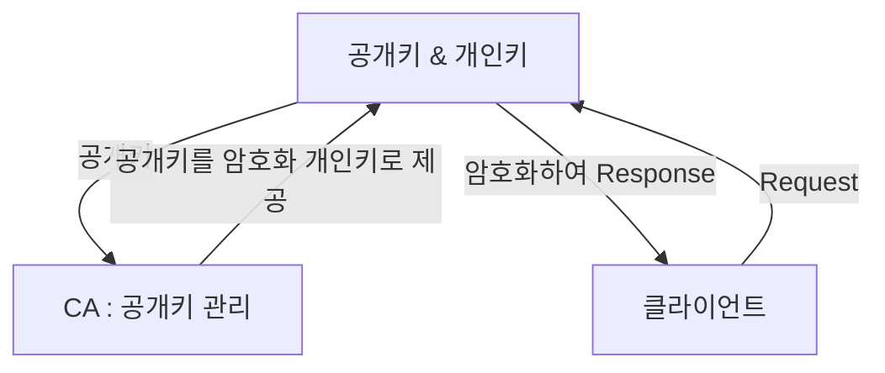

## HTTPS(HTTP Secure)
- [HTTP 프로토콜](HTTP.md)의 암호화 버전
- SSL, TLS를 활용하여 암호화

## SSL(Secure Socket Layer)
- 서버와 클라이언트 사이에 암호화된 연결을 만들어 도난 방지
- TLS(Transport Layer Servurity)는 표준화된 SSL 명칭

## HTTPS 통신 흐름

## 참조
- https://opentutorials.org/course/228/4894
- https://cheese10yun.github.io/https/